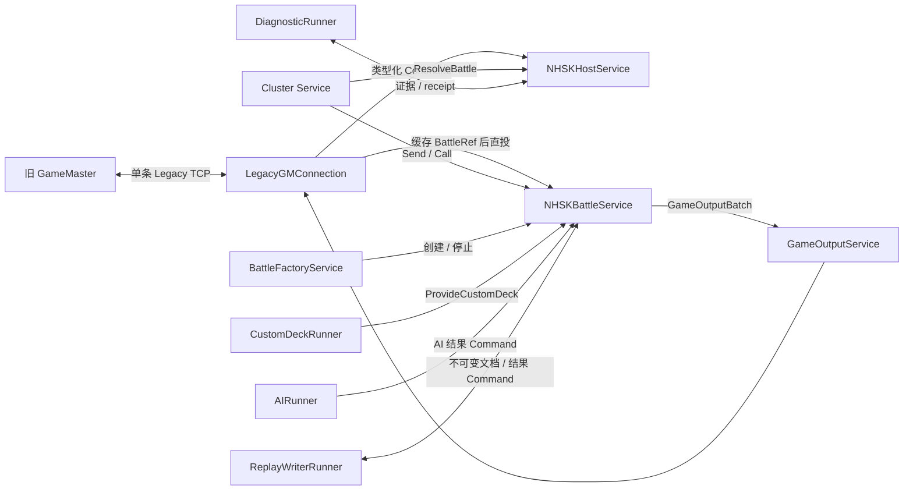
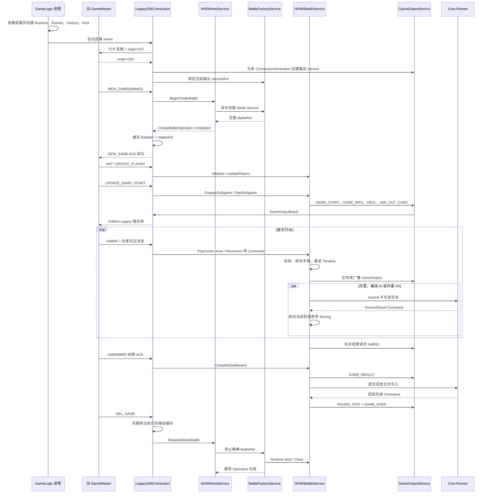

# 宁海双扣 GameLogic 示例

这个目录实现 GSR 的第一个完整棋牌游戏纵向切片：用新的 `GameLogic` 进程替换旧 GameLogic，同时保持旧 GameMaster、Agent、客户端和 TCP 二进制协议不变。旧 TCP 与新 Cluster `Send`/`Call` 最终进入同一个 `NHSKBattleService` Mailbox，不存在两套玩法逻辑。

仓库内实现和自动化验收已经完成。真正切换流量前仍必须在测试或预发布环境连接真实旧 GameMaster，完成正常局、强制结束、断线和回放比对；该外部发布门禁记录为 `CARD-065`。

权威设计见 [`RFC-0410`](../../docs/rfcs/RFC-0410-Example-NHSK-GameLogic.md)。参考核对证据见 [`nhsk-reference-reconciliation`](../../docs/reviews/nhsk-reference-reconciliation.md)，MessageID 见 [`nhsk-legacy-message-matrix`](../../docs/reviews/nhsk-legacy-message-matrix.md)。

## 本阶段做什么

- 一个独立进程主动连接旧 GameMaster，完成双向 origin、控制面、玩法 relay 和输出。
- `NHSKHostService` 管理 `BattleID -> BattleRef`、容量、异步创建/停止和隔离条目。
- 每桌一个 `NHSKBattleService`，通过 Mailbox 串行持有玩家、手牌、行动期限、结算和回放事实。
- 保留宁海双扣的发牌、出牌/过牌、抓分、固定对家、单扣/双扣、托管、外部 AI、综合结算和断线恢复。
- 保留旧回放 XML、文件名及 `FuPan/<date>/<hour>` 目录。
- 为自定义牌堆提供参数化 `ProvideCustomDeck` API；文件和 Redis 仅作为最外围旧系统兼容桥。
- 发生单桌程序缺陷时隔离该 Battle、导出诊断材料并凭精确 receipt 人工释放，不影响其他牌桌。

本阶段不替换 GameMaster、Agent、Gateway、Login 或 Auth，不实现微信认证、开发账号认证、MySQL/Redis 通用工具模块，也不引入 Protobuf。它们属于后续进程替换阶段。

## 架构与状态所有权



| 组件 | 权威状态 | 明确不拥有 |
|---|---|---|
| `LegacyGMConnection` | 当前 socket、ConnectionGeneration、I/O 队列、当前代际派生 `BattleID -> BattleRef` 缓存 | 牌局状态、Host 权威索引 |
| `NHSKHostService` | Battle 索引、Creating/Active/Stopping/Quarantined、容量、Operation | 玩家、手牌、玩法阶段 |
| `BattleFactoryService` | 创建/停止任务、Runtime 中已创建的精确 Ref | Host 业务索引、玩法状态 |
| `NHSKBattleService` | 一桌全部玩法、Timeline、结算、回放事实 | TCP、Redis、文件、另一个 Service 指针 |
| `GameOutputService` | 当前连接代际的输出能力 | 玩家会话和牌局状态 |
| Core Runner 与领域适配器 | 固定有界外部工作及其 Runtime 生命周期 | 在 Handler 外修改 Battle 状态 |

MySQL 和 Redis 都不是牌局权威状态。当前权威状态在 Service 内存中，进程崩溃后不承诺恢复旧 Battle。

### 为什么 Runner 不是 Service

Service 负责保存权威状态、按 Mailbox 顺序执行业务决定；Core Runner 只负责执行 HTTP、Redis、文件系统等可能阻塞的工作。Runner 拥有固定 worker、有限队列、取消、关闭和 Inspection，不拥有牌局状态，也不需要通过 ServiceRef 被业务寻址。把它包装成 Service 不会消除阻塞：在 Handler 内执行 I/O 会占住 Mailbox；Handler 自己启动 goroutine 又会重复实现同一套队列和生命周期。

因此边界固定为：

- Service 在 Handler 内先记录 pending 阶段或业务身份，再把深拷贝的不可变任务提交给领域适配器；AI、回放、自定义牌堆和诊断适配器都复用 Core `Runner.Submit`。
- Core Runner 只执行外部工作，不读取或修改 Service 状态，不保存 `CommandContext` 或 `ServiceContext`。
- Core Runner 完成后把 `RunnerResult` 包装成 Command，发送到任务中冻结的精确本地 ServiceRef。
- 只有目标 Service 再次在 Mailbox Handler 中核对结果并修改权威状态。
- Runtime 拥有 Runner；显式 `Close` 与 `Runtime.Close` 都会取消任务、停止接收并等待固定 worker 真实返回，超时后仍可从 `Runtime.Inspect().Runners` 观察。

如果某项外围能力以后拥有需要串行维护的权威状态、独立 Command API、跨节点寻址或业务调度策略，可以增加一个协调 Service；真正阻塞的 provider/I/O 部分仍留在 runner。例如未来可以由 `AIService` 管理额度和路由，再由 `AIProviderRunner` 执行 HTTP 请求。

### Submit 与 Await 如何处理 Mailbox

NHSK 使用的 `Submit...` 最终调用 Core `Runner.Submit`：它只校验输入、深拷贝必要数据并非阻塞尝试入队。成功表示 Runner 已接收任务；队列满或已关闭会立即返回稳定错误。真正的 HTTP、Redis 和文件写入在固定 worker 中执行。

Core 还提供 `Runner.Await`：它接收本次 Handler 仍有效的 `CommandContext`；等待外部结果时归还全局 Scheduler 许可，其他 Service 可以继续运行，但同一 Service 仍保持 busy，下一条 Mailbox Command 不会重入；结果返回后代码从原 `Await` 调用点继续。NHSK 当前的 AI、回放、自定义牌堆和诊断都需要等待期间继续响应牌局消息，因此使用 `Submit`，不使用 `Await`。

这保证的是“Handler 不发生无上限等待”，不是宣称提交调用耗时为零。提交路径不得进行网络/磁盘 I/O，也不得等待外部结果。提交失败由当前 Handler 立即按该业务的降级规则处理，例如 AI 保留硬超时回退、回放进入失败收敛、生命周期创建返回失败、诊断保留可人工重试状态。

结果可能在原 Handler 返回前就被 Runner 发送回来，但它只能排入 Mailbox，不能重入当前 Handler；同一 Service 的下一次 `Handle` 必须等当前 Handler 返回后才能执行。

Battle 创建/停止仍保留专用生命周期执行器，因为它包含创建结果投递失败后的 orphan Stop、删除屏障、诊断捕获和停止补偿，不是“processor 返回一个结果 Command”可以完整表达的单步任务。Supervisor 等带多阶段 Call、重试和补偿的执行器同理；不为表面统一删除这些状态机，也不把其业务补偿塞入 Core Runner。

### 异步完成如何保证正确时序

GSR 不保证多个外部任务按照提交顺序完成，也不靠 worker 完成顺序维护业务正确性。正确性分成三层：

1. **提交顺序**：Service Mailbox 串行执行，在提交前先冻结当前 pending 状态、OperationID 或小局/行动身份。
2. **结果入序**：runner 只能通过 `Send` 把结果作为新 Command 排回 Mailbox，不能并发修改 Service。
3. **应用资格**：Handler 用“精确 ServiceRef + 当前阶段 + 业务 fencing”判断结果是否仍属于当前事实；不匹配的迟到、重复或乱序结果直接忽略，不能回滚新状态。

| 外部工作 | 结果返回时复核 | 迟到或乱序处理 |
|---|---|---|
| AI | BattleID、GameNum、SubgameNum、TurnRevision、VerifyCode、行动开始时间、座位和玩家 | 任一不一致即忽略；硬期限继续提供本地回退 |
| 回放落盘 | BattleID、GameNum、SubgameNum、ReplayName、`FinalizingReplay` 阶段 | 超时已收敛或下一小局的旧结果无副作用 |
| 自定义牌堆 | 精确 BattleRef、BattleID、GameNum、SubgameNum、`Preparing` 阶段 | START 后到达的牌堆不能覆盖已经发出的牌 |
| Battle 创建/停止 | OperationID、BattleID、ConnectionGeneration、Factory 当前 pending/binding 和完整 Ref | 失配创建结果转为 orphan Stop；失配停止结果不能删除新绑定 |
| 隔离诊断 | BattleID、完整 Ref、当前 Quarantined 记录和最终 receipt | 旧实例或错误 receipt 不能释放当前隔离项，可显式重试导出 |

需要等待外部结果才能继续的业务，不在 Handler 内同步等待，而是进入显式中间阶段并继续处理 Mailbox。例如回放进入 `FinalizingReplay`，只接受匹配的 writer 结果或超时 Timer Command；其他不允许的状态迁移稳定拒绝。这样 Mailbox 始终可运行，同时业务状态机明确表达“正在等待什么”。

唯一需要保持 Legacy 输入先后关系的自定义牌堆兼容路径由连接 owner 在 `UPDATE_GAME` 处有界等待 provider，并保证 `ProvideCustomDeck` 已经入箱后才读取紧随其后的 START；它不发生在 Battle Service Handler 中。新的 Cluster 调用者应直接传入参数化 catalog，不复制这段 Redis 中介兼容流程。

## 主流程：从进程启动到一桌回收

下面先描述当前第一阶段最重要的 Legacy 正常路径。新 Cluster 调用模式只替换“连接、解包和寻址”部分，创建完成后同样直接向同一个 `NHSKBattleService` 发送类型化 Command，玩法和输出逻辑不分叉。



### 1. 进程组合与启动

`cmd/gamelogic/main.go` 读取 JSON 配置，调用 `NewGameLogicProcess`，然后用进程信号控制 `Run`。组合根按以下顺序创建对象：

1. 创建一个 GSR `Runtime`。
2. 创建诊断、回放、AI，以及可选自定义牌堆 Core Runner 领域适配器。
3. 创建具名 `.nhsk-battle-factory`，负责在 Runtime 中创建和停止 Battle Service。
4. 创建具名 `.nhsk-game-host`，保存 Battle 索引、容量、Operation 和隔离记录。
5. 创建唯一的 `LegacyGMConnection` 和本地诊断 Unix socket；此时还没有任何 Battle。

进程收到 `SIGINT` 或 `SIGTERM` 后，先停止 Legacy 连接，避免继续接收新输入；再关闭诊断入口和 Runner，最后关闭 Runtime 及全部 Service。Runner 或 Service 只有在真实执行返回后才算关闭。

### 2. 建立当前连接代际

`LegacyGMConnection` 主动拨号旧 GameMaster，完成 `origin=107 -> origin=100` 握手。每次成功连接产生新的 `ConnectionGeneration`，并创建一个只属于该代际的 `GameOutputService`，再把输出 Ref 绑定给 Factory。

连接代际同时限定两类外围能力：

- 输入侧的 `BattleID -> BattleRef` 路由缓存只对当前连接有效。
- 输出侧只允许仍绑定的 `GameOutputService` 向当前 socket 写数据。

因此旧连接迟到的输入或输出不能穿透到新连接。连接失败时进程持续退避重连，不重启 Runtime。

### 3. NEW_GAME 创建一桌

旧 GM 发送 `NEW_GAME(0x86c1)` 后，连接 adapter 将 `GameInnerID` 直接作为当前阶段的 `BattleID`，调用 Host 开始创建：

```text
LegacyGMConnection
  -> NHSKHostService：冻结 Creating Operation 和容量槽
  -> BattleFactoryService：在 Mailbox 外执行 Runtime.CreateService
  -> NHSKBattleService：以 AwaitingInit 状态进入 Runtime
  -> NHSKHostService：登记 Active BattleID -> BattleRef
  -> LegacyGMConnection：缓存当前代际路由
  -> GameMaster：发送成功 ACK
```

只有创建 Operation 到达终态、Host 已登记完整 `BattleRef`、连接也成功缓存路由后，才向 GM 回复成功。这样 ACK 之后紧随而来的 INIT 或玩法包不会遇到“桌号存在但 Service 尚未可达”的半成品状态。

普通创建遇到仍活动的同号 Battle 返回占用错误。只有 Legacy 同号 `NEW_GAME` 兼容路径会记录告警、完整停止旧 Ref 后再用同一 `BattleID` 创建新 Ref；它不是公开 Cluster API。

### 4. 初始化并开始小局

创建后的 Battle 初始阶段是 `AwaitingInit`。旧 GM 后续消息通过当前连接缓存直接投递，不再逐帧查询 Host：

```text
INIT_GAME       -> InitializeBattle：冻结 ProductID、MatchID、RoundID 和规则
UPDATE_PLAYER   -> UpdatePlayers：建立四个玩家与固定座位
UPDATE_GAME     -> PrepareSubgame：进入 Preparing，冻结 GameNum/SubgameNum
自定义牌堆      -> ProvideCustomDeck：可选，只能在同一 Preparing 小局内生效
COMMAND START   -> StartSubgame：发牌并进入 Playing
```

START 后 Battle 依次产生 `GAME_START`、`GAME_INFO`、每名玩家自己的 `DEAL` 和第一条 `ASK_OUT_CARD`。这些都先是协议无关的 `GameOutput`，由 `GameOutputService` 交给连接 adapter 编码成旧 `0x8644` TCP 帧。

### 5. 行动循环

客户端动作仍按“客户端 → Agent → GameMaster → GameLogic”到达。`LegacyGMConnection` 只负责拆除 `GLHeader + BSHeader + GameHeader`，校验路由字段并把 MessageID 映射为 Command；合法性和状态变化只在 Battle Mailbox 中执行。

每次行动的业务顺序是：

1. 核对当前阶段、行动玩家和 `VerifyCode`。
2. 校验牌属于当前手牌、没有重复、牌型合法，并在需要时能够压过上家；空牌表示过牌，但首出不能过。
3. 修改手牌、桌面牌、抓分牌、排名和回放事实。
4. 产生 `OUT_CARD_INFO`、一墩结束或亮牌等输出。
5. 增加 `TurnRevision`，为下一位玩家设置唯一当前行动期限并发送新的 `ASK_OUT_CARD`。

托管、本地自动和外部 AI 最终也调用同一个 `playWithSource`，不会绕过出牌校验。AI 请求由 Core Runner 执行；返回时必须同时匹配 BattleID、GameNum、SubgameNum、TurnRevision、VerifyCode、行动开始时间、座位和玩家，迟到结果直接忽略。Timer 同样携带 `TurnRevision`，所以被后续行动取代的旧期限没有副作用。

重连不创建新 Battle。`USER_RECONNECT` 更新在线事实并恢复必要推送，`GAME_SCENE` 只生成请求者视角的当前权威场景；两者仍进入同一个 Battle Mailbox。

### 6. 结算、回放和下一小局

固定对家的两名玩家都出完后，Battle 进入 `AwaitingSettlement`，停止行动期限，展示剩余手牌并向 GM 输出一次 `0x8650` 综合结算请求。GM 返回 `0x80008650` 后，Battle 校验四名玩家、TeamID 和交易矩阵，应用最终分数并输出 `GAME_RESULT`。

随后 Battle 进入 `FinalizingReplay`：不可变 XML 文档交给 Replay Runner 落盘，Battle Mailbox 继续可运行。匹配的写入结果或回放超时 Command 会收敛该阶段，并按原线序输出 `ROUND_STAT` 和 `GAME_OVER`，最后进入 `Finished`。

`GAME_RESULT`、`GAME_OVER` 或单次小局结束都不会停止 Battle Service。旧 GM 可以继续发送下一组 `UPDATE_GAME -> START`，复用同一桌和玩家关系；只有 `DEL_GAME` 才进入整桌停止流程。

### 7. DEL_GAME 与异常路径

正常删除时，连接先移除当前代际的路由缓存，避免停止期间继续向旧 Ref 投递；Host 再建立删除 Operation，由 Factory 穿过 Battle 的删除屏障并调用 Runtime Stop。停止完成后 Host 才释放索引和容量槽，`BattleID` 以后可以重新分配。

GM 连接断开时，当前代际的输出绑定和全部路由缓存立即失效；该连接关联的 Creating、Active、Stopping Battle 走异常停止，新连接只接收新局。已经 `Quarantined` 的 Battle 保留，等待诊断取证和人工凭 receipt 局部释放。

单个 Battle 发生代码缺陷时只隔离该桌并继续占用容量槽。节点健康状态变为 Degraded，但其他桌和新建桌仍可运行，直到 `Active + Quarantined` 达到配置上限。框架不会自动回收缺陷现场，也不会因为一桌异常整体回切进程。

### 8. 新 Cluster 调用从哪里接入

新调用方不需要构造 Legacy header。它通过 `.nhsk-game-host` 创建或解析一次 Battle，取得完整 `BattleRef` 后直接 `Send`/`Call` Battle Command：

```text
Cluster 调用方 -> Host：BeginCreate / ResolveBattle
Cluster 调用方 <- Host：完整 BattleRef
Cluster 调用方 -> BattleRef：Initialize / Prepare / Start / Play / Snapshot ...
```

Cluster 和 Legacy 的差别只到 adapter 与路由层为止。进入 Mailbox 后使用相同 Command、相同阶段、相同规则、相同 Timer 和相同 `GameOutput` 类型；不能增加一套“Cluster 专用玩法逻辑”。

第一阶段有两种 Cluster 用法需要区分：

- Resolve 由旧 GM 创建的非零 ConnectionGeneration Battle，再直接 Send/Call；它的类型化输出仍回到创建该桌的当前 Legacy 连接。
- 使用 `ConnectionGeneration=0` 独立创建 Battle；它用于验证 Host/Battle API、规则和 Reply，当前组合根没有为它装配输出目的地，不能宣称已经可以独立承载客户端流量。以后替换 GM 时由新的协调层显式装配类型化输出 Service。

主流程中几个容易混淆的编号保持以下含义：

| 名称 | 含义 | 生命周期 |
|---|---|---|
| `GameID` | 玩法类型，例如宁海双扣与宁海麻将是不同 GameID | 配置级稳定 |
| `BattleID` | 当前节点内同时进行的一桌编号；第一阶段直接等于旧 `GameInnerID` | DEL_GAME 完全停止后可复用 |
| `GameNum/SubgameNum` | 同一 Battle 内某次小局身份，用于准备、结算、回放和异步结果核对 | 下一小局更新 |
| `ServiceRef` | Runtime 中当前 Battle Service 实例的地址 | 实例停止后失效，不能仅凭 BattleID 猜测 |

## 代码结构

```text
examples/nhsk/
├── commands.go                 公开 CommandID、request/result、Snapshot
├── battle.go                   单桌 Service、阶段、Command handler
├── card_rules.go               牌型、合法性和压制比较
├── settlement.go               名次、单双扣、交易矩阵和结算结果
├── rules.go                    可达 BaseRule/GameRule 的最小投影
├── outputs.go                  协议无关的类型化 GameOutput
├── host.go                     Host、Factory、异步创建/停止 runner
├── output_service.go           当代输出 Service
├── legacy_connection.go        主动连接、origin、重连、派生路由缓存
├── legacy_control_mapper.go    GM 控制帧到 Host/Battle Command
├── legacy_relay_mapper.go      独立 relay mapper/路由 seam
├── legacy_mapper.go            客户端 payload 到玩法 Command
├── legacy_egress.go            GameOutput 到旧 TCP frame
├── internal/legacywire/        最小 Legacy codec 与 golden
├── ai.go                       AI request、runner、本地 provider
├── ai_legacy.go                旧 RobotTran HTTP/JSON/base64 adapter
├── custom_deck.go              参数化 catalog、旧 grammar、Core Runner 适配器
├── custom_deck_redis.go        标准库 RESP GET 兼容 adapter
├── replay_document.go          不可变回放快照与文档
├── replay_xml.go               确定性旧 XML 序列化
├── replay_writer.go            有界文件 writer
├── replay_text.go              UTF-8/GBK 文本边界
├── quarantine.go               单桌隔离、证据、receipt 与释放
├── diagnostic_admin.go         节点本地 Unix 管理端点
├── process.go                  GameLogic 组合根和关闭顺序
├── config.go                   严格 JSON 配置与环境变量覆盖
├── logging.go                  结构化日志和脱敏
├── node.go                     readiness/health 投影
├── cmd/gamelogic/main.go       可执行进程入口
├── cmd/nhskdiag/main.go        隔离诊断 CLI
└── *_test.go                   规则、golden、race、集成与 churn 门禁
```

生产代码不 import `nhsk`、`gamelogic`、`gamemaster`、`gamecore`、`protocol`、`baison_middle/protocol` 或 `nbgame_core` 的旧业务包；这些目录只用于行为、协议和测试证据复核。

## 旧调用模式

### 连接与 origin

新 GameLogic 启动后主动连接旧 GameMaster。连接建立时先发送 `origin=107` 的 `0x0600` 帧，再读取 GameMaster 返回的 `origin=100` 帧。握手完成后同一条 TCP 全双工承载控制、玩法和输出。

连接失败或断开不会退出进程。连接 owner 使用可配置的有上限指数退避和 jitter 持续重连；每次成功连接产生新的 `ConnectionGeneration`。旧代际的 Creating/Active/Stopping Battle 会收敛停止，Quarantined Battle 保留，新连接只接收新局。

### 客户端动作进入 GameLogic

旧系统逐层增加 envelope：

```text
客户端 -> Agent
  BSHeader(Type=0x7402) + Suffix

Agent -> GameMaster
  BSHeader(Type=0x7402) + GameHeader + Suffix

GameMaster -> GameLogic
  GLHeader(Type=0x8605)
  + BSHeader(Type=0x7402)
  + GameHeader
  + Suffix
```

Legacy adapter 把 `GLHeader.GameInnerID` 直接作为 `BattleID`，核对外层和内层 UserID，再按显式 MessageID 表生成类型化 Command。多层 header 到此结束，不进入 Battle 状态。

### GameLogic 输出到客户端

```text
GameLogic -> GameMaster
  GLHeader(Type=0x8644)
  + BSHeader(Type=0x7400)
  + GameHeader(UserID=目标玩家)
  + payload
```

所谓广播在 GL→GM TCP 上仍按目标玩家展开为多个定向包，不使用 `UserID=0`。GameMaster 再按 UserID 找到 Agent/玩家连接。

### Legacy 控制和玩法映射

| MessageID | 方向/含义 | GSR 目标 |
|---:|---|---|
| `0x86c1` | GM→GL NEW_GAME | Host `BeginCreateBattleCommand`；完成后回 `0x800086c0` ACK |
| `0x8600` | INIT_GAME | `InitializeBattleCommand` |
| `0x8601` | UPDATE_PLAYER | `UpdatePlayersCommand` |
| `0x8602` | COMMAND START/MATCH_STOP | `StartSubgameCommand` / `ForceFinishSubgameCommand` |
| `0x8604` | UPDATE_GAME | `PrepareSubgameCommand` |
| `0x8606` | PLAYER_EXIT | `ExitPlayerCommand` |
| `0x860d` | START_NEW_GAME | `UpdateRoundContextCommand`，只更新下一局回放上下文 |
| `0x8610` | DRESS | `UpdatePlayerDressCommand` |
| `0x86c2` | DEL_GAME | Host `RequestDeleteBattleCommand` |
| `0x80008650` | 综合结算 ACK | `CompleteSettlementCommand` |
| `0x8605` | GM→GL GAME_MSG envelope | 继续解析内层 allowlist |
| `0x7701` | OUT_CARD | `PlayCardsCommand` |
| `0x7702` | CARD_ACTION 预览 | `PreviewCardSelectionCommand` |
| `0x720A` | 托管状态 | `SetPlayerAutoStateCommand` |
| `0x7208` | USER_RECONNECT | `ReconnectPlayerCommand` |
| `0x720D` | GAME_SCENE | `RequestGameSceneCommand` |
| `0x7218` | 已成功使用道具事实 | `RecordPropUseCommand`，只写回放 |
| `0x8644` | GL→GM 客户端输出 envelope | `GameOutputBatch` 的 Legacy 编码 |
| `0x8641` | GAME_OVER | `GameOverOutput`，包含四座 Score/Exp/Auto |
| `0x864e` | NOTICE_ROUND_OVER | 仅 MATCH_STOP 强制结束路径 |

未工作的 `0x7200` 输入、`0x8655` 输出，以及没有目标使用证据的投票、骰子、旁观、战绩等分支不实现，也不保留空 handler。

### 当前连接的 Battle 路由

NEW_GAME 的终态 `CreateBattleOperation` 必须返回同一个 BattleID 和非零完整 `BattleRef`。连接 owner 在发送成功 ACK 前，将它缓存到当前 ConnectionGeneration 的派生路由表。后续 INIT、控制和玩法帧直接投递该 Ref，不逐帧 Call Host。

同号 Legacy NEW_GAME 会先失效旧缓存、完全停止 Active 旧实例，再创建新 Ref；Cluster 创建没有该异常替换能力。DEL_GAME 先失效缓存，再请求 Host 停止。断线时整个 session 路由表丢弃。旧 Ref 即使残留也只会稳定投递失败，不会命中新实例。

`RouteLegacyGameplaySend/Call` 是给独立、无连接缓存适配器使用的路由 seam，因此会显式 Resolve Host；正式 `GameLogicProcess` 的默认连接路径使用上述代际缓存。

## 新 Cluster 调用模式

### 创建和取得 BattleRef

Cluster 创建时 `ConnectionGeneration` 必须为 0。创建是异步 Operation，Host Handler 不直接调用 Runtime 生命周期：

```go
value, err := runtime.Call(ctx, hostRef,
    nhsk.BeginCreateBattleCommand,
    nhsk.CreateBattleRequest{BattleID: 12345},
)
operation := value.(nhsk.CreateBattleOperation)

for operation.Phase == nhsk.HostOperationCreating {
    value, err = runtime.Call(ctx, hostRef,
        nhsk.GetCreateBattleOperationCommand,
        nhsk.GetCreateBattleOperationRequest{OperationID: operation.OperationID},
    )
    operation = value.(nhsk.CreateBattleOperation)
}
if operation.Phase != nhsk.HostOperationCompleted {
    // 使用 operation.Rejection 处理稳定失败。
}
battleRef := operation.Ref
```

也可以在创建完成后调用 `ResolveBattleCommand`。调用方不能猜 ServiceID，也不能把旧 Ref 跨节点重启继续使用。

普通 Cluster 创建遇到 Creating、Active、Stopping 或 Quarantined 同号条目会拒绝，不公开 `ReplaceExisting`。

### 初始化和开始小局

```go
rules := nhsk.DefaultNHSKConfig()

_, err = runtime.Call(ctx, battleRef,
    nhsk.InitializeBattleCommand,
    nhsk.InitializeBattleRequest{
        Identity: nhsk.BattleIdentity{
            BattleID: 12345,
            ProductID: 82,
            MatchID: 88,
            RoundID: 1,
            RoundUniCode: "round-1",
        },
        MaxGameNum: 1,
        MaxSubgameNum: 1,
        Rules: &rules,
    },
)

_, err = runtime.Call(ctx, battleRef,
    nhsk.UpdatePlayersCommand,
    nhsk.UpdatePlayersRequest{Players: fourPlayers},
)
_, err = runtime.Call(ctx, battleRef,
    nhsk.PrepareSubgameCommand,
    nhsk.PrepareSubgameRequest{GameNum: 1, SubgameNum: 1},
)
_, err = runtime.Call(ctx, battleRef, nhsk.StartSubgameCommand, struct{}{})
```

阶段为：

```text
AwaitingInit
  -> Preparing
  -> Playing
  -> AwaitingSettlement
  -> FinalizingReplay
  -> Finished

任意存活阶段 -> Stopping
程序缺陷/停止超时 -> Host Quarantined
```

下一小局仍由协调者发送 `PrepareSubgame` 和 `StartSubgame`。Battle 不自行开始下一局，也不自行释放实例。

### Send、Call 与输出

```go
// 不需要当前业务结果：只保证成功进入 Mailbox。
err := runtime.Send(battleRef,
    nhsk.SetPlayerAutoStateCommand,
    nhsk.SetPlayerAutoStateRequest{Player: "1001", Enabled: true},
)

// 需要明确知道动作是否被接受。
value, err := runtime.Call(ctx, battleRef,
    nhsk.PlayCardsCommand,
    nhsk.PlayCardsRequest{
        Player: "1001", Cards: []byte{0x03}, VerifyCode: 3,
    },
)
result := value.(nhsk.ActionResult)

// 纯查询，不改变托管、Offline、ClientReady 或输出。
value, err = runtime.Call(ctx, battleRef,
    nhsk.GetNHSKBattleSnapshotCommand, struct{}{},
)
snapshot := value.(nhsk.NHSKBattleSnapshot)
```

`Call` Reply 只描述当前 Command 是否应用，不复制客户端广播。Call 超时不取消已经进入 Mailbox 的 Command，也不授权自动重发。本示例不为普通玩法增加通用 RequestID、幂等表或结果缓存；超时后先查询权威 Snapshot。

玩法产生的 `ClientGameOutput`、`GameStartedOutput`、`SettlementRequestOutput`、`GameOverOutput` 和 `NoticeRoundOverOutput` 仍走异步 `GameOutputBatch`。旧 GM adapter 编码 Legacy frame；未来 Agent/GM 直接消费同一个类型化输出。

第一阶段真正承载玩家流量的是旧 GM 通过非零 ConnectionGeneration 创建的 Battle；Cluster 调用者可以 Resolve 它并直接 Send/Call，输出仍回到创建它的当前 Legacy 连接。`ConnectionGeneration=0` 的独立 Cluster 创建已经可验证 Host/Battle API 和玩法 Reply，但当前进程不会为它猜测输出目的地，因此不把它宣称为可独立承载客户端流量的生产组合。以后替换 GM 时，应由新协调层显式装配类型化输出 Service，而不是让 Battle 认识 socket 或 Agent。

### 参数化自定义牌堆 API

规范入口直接接收外部已经兼容好的参数：

```go
_, err := runtime.Call(ctx, battleRef,
    nhsk.ProvideCustomDeckCommand,
    nhsk.ProvideCustomDeckRequest{
        BattleID: 12345,
        GameNum: 1,
        SubgameNum: 1,
        Catalog: nhsk.CustomDeckCatalog{
            Decks: []nhsk.CustomDeck{{Cards: cards, BankerSeat: 2}},
        },
    },
)
```

Battle 只在当前小局为 Preparing 且三项身份一致时接受，并深拷贝 catalog。外部参数、Redis key、文件路径、白名单和旧文本 grammar 都不进入 Battle API。

为兼容旧部署，进程外围可选择：

- `source=file`：读取旧调试文件。
- `source=redis`：用标准库 RESP GET，优先 `game:makecard:<ProductID>`，空值才回退 `game:makecard:<GameID>`。

Redis 读取失败、队列满、超时或内容非法时不隔离 Battle，直接使用普通发牌。真实 Redis 集成测试存在时自动运行，机器没有 `redis-server` 时明确 skip。

## 玩法和输出线序

### 开局

START 要求 INIT 完成、GameNum/SubgameNum 有效、四个不同非零玩家占据 0..3 四座且均未 Exited。成功后一次性冻结玩家、装扮、回放上下文、最终手牌和小局开始时间，输出顺序固定为：

```text
GAME_START
-> GAME_STARTED
-> GameInfo
-> Seat0 Deal
-> Seat1 Deal
-> Seat2 Deal
-> Seat3 Deal
-> AskOutCard
```

发牌优先级为：可用自定义牌堆优先；否则普通确定性洗牌，再按配置执行新手调整或散牌调整。所有随机只使用 Battle 私有 PRNG，生产 seed 来自 `crypto/rand`。

### 出牌、过牌和行动期限

- 支持单张、对子、三张、三带二及 4～8 张炸弹。
- 真正 OUT_CARD 校验当前玩家、VerifyCode、手牌归属、重复数量、牌型和是否压过上家。
- CARD_ACTION 只是旧客户端选牌预览，按参考保留宽松语义，不修改权威状态。
- 每个 `TurnRevision` 只有一个有效 ActionDeadline，不复制旧系统的双 Timer。
- 普通超时、托管、本地机器人、外部 AI 与 AI 超时最终都回到相同动作校验。
- 三家过牌后先输出 `TurnEnd`，结清当前墩 5/10/K 分牌，再产生下一次 Ask。

### 重连与场景

`USER_RECONNECT` 清除 Offline，Playing 时退出托管；`GAME_SCENE` 不清除 Offline，但要求当前大局/小局匹配。两者共用恢复视图构造，按请求者可见性输出 GameInfo、GameScene、当前 Ask，并在结果展示阶段按契约发送 ShowCards。

Cluster `GetNHSKBattleSnapshot` 是纯查询，不能替代这两个带业务副作用的 Legacy Command。

### 正常结算

固定对家的两名队员都出完后进入 AwaitingSettlement，并输出一次 `0x8650` 综合结算请求。成功 ACK 必须完整包含当前四人、唯一 TeamID 0..3 和合法交易矩阵；整包不合法时不部分修改状态。

成功结果的可观察线序为：

```text
ShowCards
-> GameResult
-> 冻结完整 ReplayDocument
-> ReplayWriter 结果
-> ROUND_STAT（仅 ClientReady 玩家，PlayerCount=0）
-> GAME_OVER（四座 Score/Exp/Auto）
-> Finished
```

客户端结果先于磁盘回放；GAME_OVER 等待回放成功、失败或超时三者之一收敛。回放失败不回滚客户端结果，也不隔离 Battle。

`MATCH_STOP` 在 Playing/AwaitingSettlement 替换在途玩法或结算，跳过外部 0x8650，使用本地 Success 结果，最终在 GAME_OVER 后追加 NOTICE。其他阶段 no-op。

### 回放

回放文件名为：

```text
NHSK_M<ProductID>R<RoundID>_<YYYYMMDD>_<HHMMSS>_<Seat0UserID>.xml
```

写入：

```text
<replay.root>/FuPan/<YYYYMMDD>/<HH>/文件名
```

XML 固定包含 Info、Moves、GameOver、Summary、Dress、Other；玩家、Deal、动作来源/耗时、抓分、结果、托管统计和炸弹明细均从不可变快照生成。旧 XML 属性名 `Actor` 只存在于序列化边界，GSR 领域模型仍使用 `ReplayMoveSource`。

## 删除、断线与隔离

### 正常 DEL_GAME

Host 先把条目标为 Stopping。生命周期 runner 向精确 BattleRef Call 删除屏障；屏障在 Mailbox 中取消行动、禁止新输出并 fence 迟到 AI/结算/回放结果，然后 Runtime Stop。只有 Stop 真正返回后，Host 才删除绑定并允许 BattleID 复用。

屏障不等待已经提交的文件 I/O，也不补偿或删除可能产生的孤立回放。

### 单桌程序缺陷

Handler/Timer panic、状态不变量失败或 Stop 超时只隔离当前 Battle：

- Host 条目进入 Quarantined，保留 BattleID、Ref 和容量槽。
- 其他牌桌继续，新编号仍可创建，直到总容量耗尽。
- GM 断线、DEL_GAME 和同号 NEW_GAME 都不能自动释放隔离桌。
- 节点健康状态为 Degraded，但不伪造 GameResult/GAME_OVER。
- 诊断 runner 原子发布 manifest、snapshot、commands、panic、Runtime inspection 和 receipt。
- 只有绑定同一 BattleID、完整 Ref 和材料摘要的 receipt 才能人工局部释放。

代码修复通过正常部署重新上线；没有“整体回切”自动逻辑。

## 配置与启动

需要 Go 1.23.3。GameLogic 默认不需要 MySQL、Redis、微信或外部 AI 才能启动。

```bash
GOCACHE=/tmp/gsr-gocache go run ./examples/nhsk/cmd/gamelogic \
  -config examples/nhsk/config.example.json
```

示例配置的关键部分：

| 配置 | 用途 | 默认/约束 |
|---|---|---|
| `node.id` | GSR NodeID | 必填 |
| `node.workers` | Runtime 固定 worker 数 | 正数 |
| `node.max_active_battles` | Creating/Active/Stopping/Quarantined 总容量 | 示例 10000 |
| `legacy_gm.address` | 旧 GM 地址 | 必须是 host:port |
| `legacy_gm.*backoff*` | 无限重连策略 | jitter 必须在 0..1 之间且不能为 0 |
| `custom_deck` | 最外围旧牌堆 bridge | 默认关闭 |
| `redis` | 仅供 Redis 牌堆兼容 | 默认关闭，不是权威状态 |
| `ai.provider` | `local` 或 `http` | 默认 local，无外部依赖 |
| `replay.root` | 回放根目录 | 必须可写 |
| `diagnostic.root` | 隔离材料根目录 | 必须可写 |
| `diagnostic.admin_socket` | 节点本地管理 socket | 启动时创建，权限 0600 |
| `mysql` / `wechat` | 后续脚手架配置占位校验 | 当前 GameLogic 不连接它们，默认关闭 |

环境变量可覆盖 NodeID、GM 地址、worker、容量、重连参数、Redis 地址/密码、AI provider/URL、回放/诊断路径和日志级别；完整列表以 `config.go` 的 `applyEnvironment` 为准。JSON 使用严格字段校验，未知字段、尾随第二个文档和非法 duration 会直接拒绝启动。

进程收到 SIGINT/SIGTERM 后停止重连和本地管理端点，关闭固定 runner，并等待 Runtime 生命周期真实返回。当前没有独立 HTTP health 端口；组合根的 `Health()` 区分 GM NotReady、Ready 和存在隔离桌的 Degraded，部署层可据此接入自己的健康暴露方式。

## 诊断 CLI

列出隔离桌：

```bash
go run ./examples/nhsk/cmd/nhskdiag \
  -socket diagnostics/nhsk-admin.sock \
  -op list
```

重试某个精确实例的材料导出：

```bash
go run ./examples/nhsk/cmd/nhskdiag \
  -socket diagnostics/nhsk-admin.sock \
  -op retry \
  -battle 12345 \
  -ref-node nhsk-gamelogic-1 \
  -ref-id 99
```

取证确认后，凭导出目录中的 `receipt.json` 释放；材料不会随释放自动删除：

```bash
go run ./examples/nhsk/cmd/nhskdiag -op release -receipt /path/to/receipt.json
go run ./examples/nhsk/cmd/nhskdiag -op cleanup -receipt /path/to/receipt.json
```

管理面只监听本机 Unix socket，不进入 Legacy 或 Cluster 公开协议。

## 测试与验收

在仓库根目录执行：

```bash
GOCACHE=/tmp/gsr-gocache go test ./...
GOCACHE=/tmp/gsr-gocache go vet ./...
GOCACHE=/tmp/gsr-gocache go test -race ./...
git diff --check
```

NHSK 门禁覆盖：

- 双向 origin、NEW_GAME/ACK、控制面、三层入站和两层出站完整字节 golden。
- 104 张牌、牌型、压制、抓分、单双扣、新手、散牌和自定义牌堆。
- fake Clock、唯一 ActionDeadline、托管、外部 AI、迟到结果和重连。
- 成功/坏/失败/重复结算、MATCH_STOP、回放结果和 DEL_GAME 竞争。
- Handler/Timer panic、Stop timeout、诊断导出、receipt 释放和容量占用。
- 100,000 次真实 Battle Service 创建/停止后 Registry、Task、PendingCall、Timer 与 goroutine 回到基线。
- 本机存在 `redis-server` 时启动临时真实 Redis 验证旧 key/RESP/牌堆；不存在时该测试明确 skip。

完整 10 万次 churn 在普通测试中约几十秒，在 race 下通常需要数分钟，这是刻意保留的生命周期门禁。

## 发布前外部门禁

仓库内自动化不能替代真实旧 GameMaster 联调。切换测试/预发布环境前至少确认：

1. 新 GameLogic 成功完成双向 origin，GM 把连接识别为 GameLogic。
2. 跑通 NEW_GAME→INIT→UPDATE_PLAYER→UPDATE_GAME→START 和一局正常综合结算。
3. 对比客户端开局、动作、GameResult、ROUND_STAT、GAME_OVER 的 MessageID、目标和顺序。
4. 跑通 MATCH_STOP 紧随 DEL_GAME，确认旧 GM 的 Round 清理行为。
5. 主动断开 GM 链路，确认旧代际普通 Battle 收敛且进程持续重连。
6. 对比一份实际回放 XML、文件名和目录。
7. 验证回切方式：当前部署是 GM/GL 一一对应，异常时把 GM 的 GameLogic 地址整体切回旧进程，不做新旧 GL 同时接入。

## 后续阶段

- 替换 GameMaster：新 GM 从有限编号池分配空闲 BattleID，调用 Host 创建并保存返回的 BattleRef，随后直接 Send/Call；不再生成 Legacy envelope。
- 替换 Agent：Gateway 拥有 socket，Agent 拥有玩家会话和重连窗口，用 `ClientGameOutput.Targets` 路由客户端；Battle 不感知连接编号。
- 再建设 Auth/Login/Gateway、微信 provider、`account + shared token` 开发认证、结构化日志、MySQL/Redis 工具模块和完整四人登录入桌示例。
- 只有第二个真实玩法证明共同需求后，才把 NHSK 中的能力提升为通用棋牌游戏模板。
