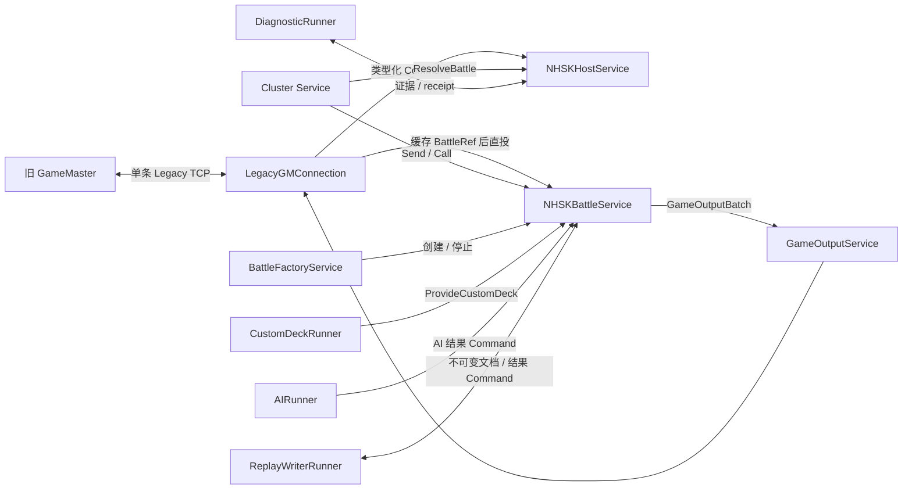
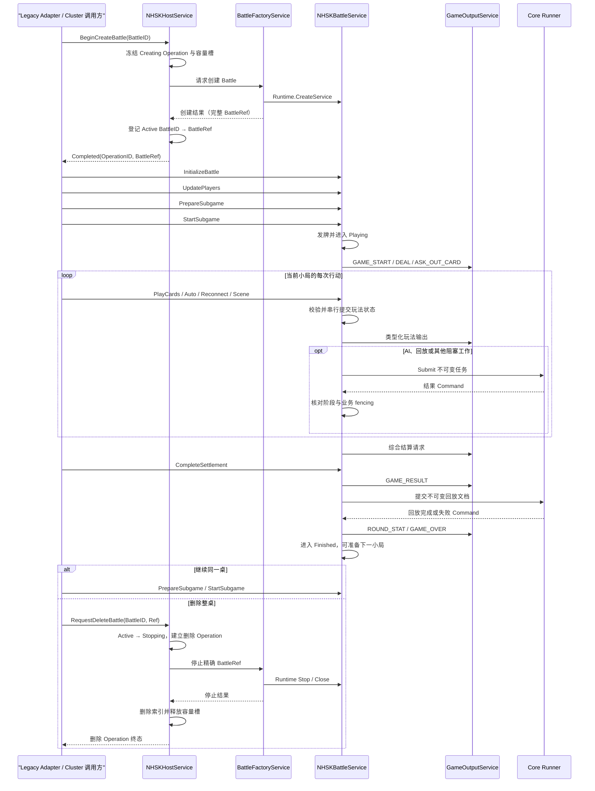
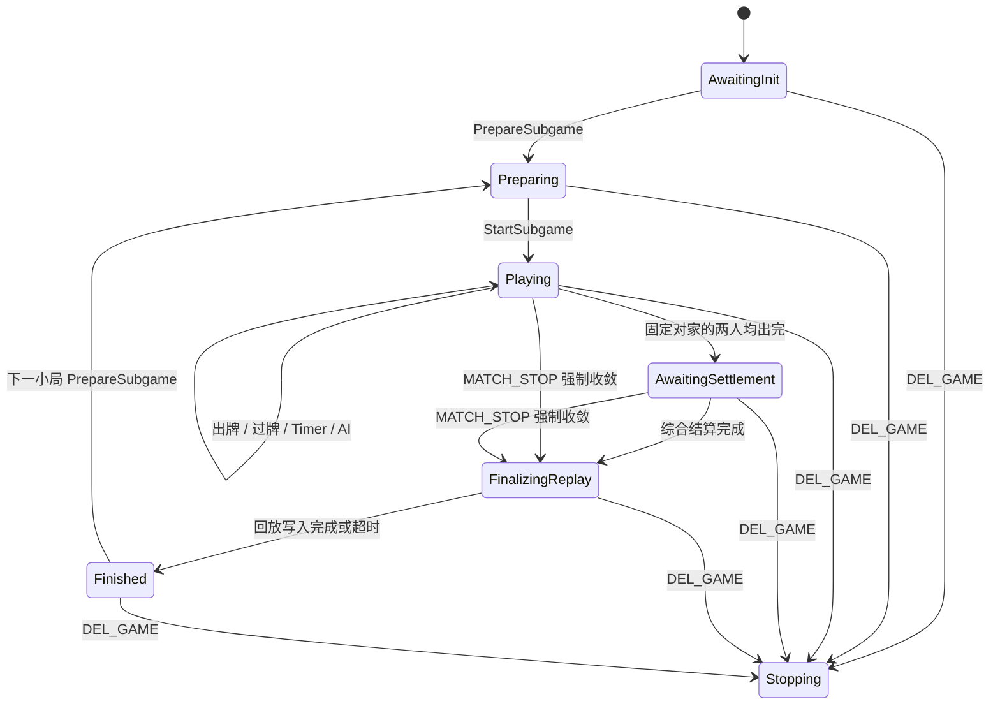

# 宁海双扣 GameLogic 示例

这个目录实现 GSR 的第一个完整棋牌游戏纵向切片：用新的 `GameLogic` 进程替换旧 GameLogic，同时保持旧 GameMaster、Agent、客户端和 TCP 二进制协议不变。旧 TCP 与新 Cluster `Send`/`Call` 最终进入同一个 `NHSKBattleService` Mailbox，不存在两套玩法逻辑。

仓库内实现和自动化验收已经完成。真正切换流量前仍必须在测试或预发布环境连接真实旧 GameMaster，完成正常局、强制结束、断线和回放比对；该外部发布门禁记录为 `CARD-065`。

权威设计见 [`RFC-0410`](../../docs/rfcs/RFC-0410-Example-NHSK-GameLogic.md)。参考核对证据见 [`nhsk-reference-reconciliation`](../../docs/reviews/nhsk-reference-reconciliation.md)，MessageID 见 [`nhsk-legacy-message-matrix`](../../docs/reviews/nhsk-legacy-message-matrix.md)。

## 本阶段做什么

- 一个独立进程主动连接旧 GameMaster，完成双向 origin、控制面、玩法 relay 和输出。
- `NHSKHostService` 管理 `BattleID -> BattleRef`、容量、异步创建/停止和隔离条目。
- 每桌一个 `NHSKBattleService`，通过 Mailbox 串行持有玩家、手牌、行动期限、结算和回放事实。
- 保留宁海双扣的发牌、出牌/过牌、抓分、固定对家、单扣/双扣、托管、外部 AI、综合结算和断线恢复。
- 保留旧回放 XML、文件名及 `FuPan/<date>/<hour>` 目录。
- 为自定义牌堆提供参数化 `ProvideCustomDeck` API；文件和 Redis 仅作为最外围旧系统兼容桥。
- 发生单桌程序缺陷时隔离该 Battle、导出诊断材料并凭精确 receipt 人工释放，不影响其他牌桌。

本阶段不替换 GameMaster、Agent、Gateway、Login 或 Auth，不实现微信认证、开发账号认证、MySQL/Redis 通用工具模块，也不引入 Protobuf。它们属于后续进程替换阶段。

## 架构与状态所有权



| 组件 | 权威状态 | 明确不拥有 |
|---|---|---|
| `LegacyGMConnection` | 当前 socket、ConnectionGeneration、I/O 队列、当前代际派生 `BattleID -> BattleRef` 缓存 | 牌局状态、Host 权威索引 |
| `NHSKHostService` | Battle 索引、Creating/Active/Stopping/Quarantined、容量、Operation | 玩家、手牌、玩法阶段 |
| `BattleFactoryService` | 创建/停止任务、Runtime 中已创建的精确 Ref | Host 业务索引、玩法状态 |
| `NHSKBattleService` | 一桌全部玩法、Timeline、结算、回放事实 | TCP、Redis、文件、另一个 Service 指针 |
| `GameOutputService` | 当前连接代际的输出能力 | 玩家会话和牌局状态 |
| Core Runner 与领域适配器 | 固定有界外部工作及其 Runtime 生命周期 | 在 Handler 外修改 Battle 状态 |

MySQL 和 Redis 都不是牌局权威状态。当前权威状态在 Service 内存中，进程崩溃后不承诺恢复旧 Battle。

## 这个综合示例使用了哪些 GSR 能力

宁海双扣不是把旧代码换一种目录摆放，而是把一套真实 GameLogic 拆到 GSR 的运行模型上。下面列出的都是当前实现已经使用的能力；每一项都能在正常牌局、异常路径或测试中找到实际作用。

| GSR 能力 | 在宁海双扣中的使用方式 | 带来的保证 |
|---|---|---|
| `Runtime` 与固定 Scheduler | `GameLogicProcess` 创建一个 Runtime，并通过 `Workers` 配置固定执行许可；Host、Factory、Output 和所有 Battle 共用它 | 不为每桌创建线程；大量 Battle 由有界执行资源调度 |
| `Service` / `ServiceSpec` | Host、Factory、每桌 Battle、每个连接代际的 Output 都是 Service | 每种长期状态都有明确 owner、Handler 和生命周期 |
| `ServiceName` | `.nhsk-game-host`、`.nhsk-battle-factory` 是稳定具名服务；动态 Battle 使用 `nhsk-battle/<BattleID>` 便于观测 | 名字用于 bootstrap 和诊断，不把固定数字 ID 写进业务 |
| `ServiceRef` | Host 保存 `BattleID -> BattleRef`；调用方取得 Ref 后直接访问 Battle；Service 之间只保存 Ref | 业务编号与运行实例地址分离，停止后的旧 Ref 不会变成对象指针旁路 |
| `Command` 与单一 `Handle` | Legacy MessageID 和新 Cluster API 都映射为同一组类型化 Command；Host/Battle 在 `Handle` 中分发 | 协议入口最终汇合为一套业务实现，未知 Command 稳定拒绝 |
| Mailbox 串行 | Host 串行修改索引和 Operation；Battle 串行修改玩家、手牌、Timeline、结算和回放事实 | 同一 Service 内不用业务锁，不会同时执行两个状态迁移 |
| `Send` | Legacy 输入、玩法广播、Runner 结果和多数内部通知使用 Send | 调用方不需要当前返回值时只负责投递，不制造同步调用链 |
| `Call` / `Reply` | Cluster 调用取得动作结果和 Snapshot；Host 查询创建 Operation；删除执行器 Call Battle 删除屏障和诊断捕获 | 需要当前结果时有明确 Reply、超时和迟到 Reply 语义；Reply 不替代异步客户端输出 |
| `CommandContext.Source()` | Factory 校验内部 Command 必须来自 Host、本节点 Runtime 根或精确 Battle Ref | 内部生命周期能力不能仅靠伪造 payload 调用 |
| `ServiceContext.After` | Battle 为出牌机会和回放收尾投递未来 Timer Command | Timer 不执行玩法回调；到期动作仍回到同一 Mailbox 串行处理 |
| Service 生命周期 | Factory 使用 `CreateService` 动态创建每桌 Battle，删除屏障后使用 `Stop`；进程退出最终 `Runtime.Close` | Create、Handle、Stop、Close 有统一接受边界，停止时 Runtime 清理 Mailbox、Timer 和注册信息 |
| Core `Runner.Submit` | AI HTTP、回放写盘、自定义牌堆读取和诊断导出在固定 worker、有限队列中执行，结果以 Command 返回 | 阻塞 I/O 不占住 Battle Mailbox；任务可取消、可关闭并等待真实返回 |
| 背压与稳定错误 | Mailbox 满、Runner 队列满、Service 已关闭、Call 超时等错误由调用处显式处理 | 超载不会悄悄变成无限 goroutine 或无限内存队列 |
| Logger 与 Metrics | Service 通过 Context 记录 AI、回放、协议丢弃、隔离等指标和结构化日志 | 业务观测复用 Runtime 上下文，不维护另一套全局可变统计对象 |
| `Runtime.Inspect()` | 健康检查读取 Metrics；诊断导出保存 Runtime、Service、Mailbox、Timer、任务和 Runner 的只读快照 | 观测不直接读取或修改 Service 私有状态，异常现场可以随 Battle 证据一起保存 |
| Runtime 失败边界 + 业务隔离 | Battle decorator 在 Handler 边界记录最近稳定 Snapshot、Command 序列和 panic；Runtime 将失败实例变为不可继续处理，Host 保存 Quarantined 条目 | 单桌代码缺陷不会继续污染状态，也不要求整个节点退出；释放策略仍由 NHSK 业务层决定 |

### 这些能力怎样组成一条业务链

`NEW_GAME` 同时展示了 Service 寻址、Mailbox、Call/Reply 和生命周期：请求先进入 Host Mailbox，Host 冻结 Operation，再让 Factory 在 Handler 外创建 Battle；创建结果作为 Command 回到 Host，最终向调用方交出 `BattleRef`。

一次出牌展示了 Command、Mailbox、Timer 和异步输出：输入以 Send 或 Call 进入 Battle，Battle 在一个 Handler 中完成合法性校验和状态提交，再向 Output Service 发送结果，并用 `After` 安排下一次行动期限。

一次 AI 或回放任务展示了 Runner 的正确用法：Battle 先冻结 TurnRevision、ReplayName 或阶段，再 `Submit` 不可变任务；Runner 完成顺序不可信，结果必须重新进入 Mailbox，并由 Battle 判断是否仍有资格应用。

一次 `DEL_GAME` 展示了跨 Service 协作与停止边界：Host 建立 Stopping Operation，Factory 先 Call Battle 的删除屏障，随后 Stop 精确 `BattleRef`，最后把结果 Send 回 Host；Host 只在停止完成后释放编号和容量。

单桌 panic 展示了 Runtime 失败语义与业务策略的分层：Runtime 保证失败 Service 不再继续正常处理，NHSK 的隔离边界负责收集牌局证据，Host 决定保留容量和等待人工 receipt。Core 不内置“棋牌游戏隔离”概念。

### 当前没有使用的 GSR 能力

这个示例覆盖面很广，但不应因此宣称用到了整个 GSR：

- 当前 `GameLogicProcess` 只创建本地 Runtime，没有装配 Cluster Transport 和 NHSK Cluster Codec。公开 Command 和 `ServiceRef` 契约可以被未来远程 Cluster 调用复用，但当前进程并未实际监听 GSR 集群端口。
- 没有使用 `ResolveRemote`、Discovery、ServiceGroup、Router、Drain、Controller 或 NodeAgent；第一阶段仍由旧 GameMaster 和当前连接代际决定路由。
- 没有使用 Snapshot Store 恢复或 Supervisor 自动重建。进程崩溃后旧 Battle 不恢复；单桌缺陷选择保留隔离证据。
- 没有使用 Core `Runner.Await`。AI、回放、自定义牌堆和诊断都要求等待期间 Battle 继续处理 Mailbox，因此统一使用 `Submit`。
- 没有使用 GSR 的 Login、Gateway、Room、PlayerService 或 Wallet 模板。本阶段冻结这些上游职责，只替换旧 GameLogic。

因此，这个例子主要验证的是：**Service/ServiceRef/Command、Mailbox/Scheduler、Send/Call/Reply、Timer、生命周期、Runner、Inspection 和失败隔离，能否共同承载一套可兼容旧系统的完整棋牌游戏 GameLogic。**

### 为什么 Runner 不是 Service

Service 负责保存权威状态、按 Mailbox 顺序执行业务决定；Core Runner 只负责执行 HTTP、Redis、文件系统等可能阻塞的工作。Runner 拥有固定 worker、有限队列、取消、关闭和 Inspection，不拥有牌局状态，也不需要通过 ServiceRef 被业务寻址。把它包装成 Service 不会消除阻塞：在 Handler 内执行 I/O 会占住 Mailbox；Handler 自己启动 goroutine 又会重复实现同一套队列和生命周期。

因此边界固定为：

- Service 在 Handler 内先记录 pending 阶段或业务身份，再把深拷贝的不可变任务提交给领域适配器；AI、回放、自定义牌堆和诊断适配器都复用 Core `Runner.Submit`。
- Core Runner 只执行外部工作，不读取或修改 Service 状态，不保存 `CommandContext` 或 `ServiceContext`。
- Core Runner 完成后把 `RunnerResult` 包装成 Command，发送到任务中冻结的精确本地 ServiceRef。
- 只有目标 Service 再次在 Mailbox Handler 中核对结果并修改权威状态。
- Runtime 拥有 Runner；显式 `Close` 与 `Runtime.Close` 都会取消任务、停止接收并等待固定 worker 真实返回，超时后仍可从 `Runtime.Inspect().Runners` 观察。

如果某项外围能力以后拥有需要串行维护的权威状态、独立 Command API、跨节点寻址或业务调度策略，可以增加一个协调 Service；真正阻塞的 provider/I/O 部分仍留在 runner。例如未来可以由 `AIService` 管理额度和路由，再由 `AIProviderRunner` 执行 HTTP 请求。

### Submit 与 Await 如何处理 Mailbox

NHSK 使用的 `Submit...` 最终调用 Core `Runner.Submit`：它只校验输入、深拷贝必要数据并非阻塞尝试入队。成功表示 Runner 已接收任务；队列满或已关闭会立即返回稳定错误。真正的 HTTP、Redis 和文件写入在固定 worker 中执行。

Core 还提供 `Runner.Await`：它接收本次 Handler 仍有效的 `CommandContext`；等待外部结果时归还全局 Scheduler 许可，其他 Service 可以继续运行，但同一 Service 仍保持 busy，下一条 Mailbox Command 不会重入；结果返回后代码从原 `Await` 调用点继续。NHSK 当前的 AI、回放、自定义牌堆和诊断都需要等待期间继续响应牌局消息，因此使用 `Submit`，不使用 `Await`。

这保证的是“Handler 不发生无上限等待”，不是宣称提交调用耗时为零。提交路径不得进行网络/磁盘 I/O，也不得等待外部结果。提交失败由当前 Handler 立即按该业务的降级规则处理，例如 AI 保留硬超时回退、回放进入失败收敛、生命周期创建返回失败、诊断保留可人工重试状态。

结果可能在原 Handler 返回前就被 Runner 发送回来，但它只能排入 Mailbox，不能重入当前 Handler；同一 Service 的下一次 `Handle` 必须等当前 Handler 返回后才能执行。

Battle 创建/停止仍保留专用生命周期执行器，因为它包含创建结果投递失败后的 orphan Stop、删除屏障、诊断捕获和停止补偿，不是“processor 返回一个结果 Command”可以完整表达的单步任务。Supervisor 等带多阶段 Call、重试和补偿的执行器同理；不为表面统一删除这些状态机，也不把其业务补偿塞入 Core Runner。

### 异步完成如何保证正确时序

GSR 不保证多个外部任务按照提交顺序完成，也不靠 worker 完成顺序维护业务正确性。正确性分成三层：

1. **提交顺序**：Service Mailbox 串行执行，在提交前先冻结当前 pending 状态、OperationID 或小局/行动身份。
2. **结果入序**：runner 只能通过 `Send` 把结果作为新 Command 排回 Mailbox，不能并发修改 Service。
3. **应用资格**：Handler 用“精确 ServiceRef + 当前阶段 + 业务 fencing”判断结果是否仍属于当前事实；不匹配的迟到、重复或乱序结果直接忽略，不能回滚新状态。

| 外部工作 | 结果返回时复核 | 迟到或乱序处理 |
|---|---|---|
| AI | BattleID、GameNum、SubgameNum、TurnRevision、VerifyCode、行动开始时间、座位和玩家 | 任一不一致即忽略；硬期限继续提供本地回退 |
| 回放落盘 | BattleID、GameNum、SubgameNum、ReplayName、`FinalizingReplay` 阶段 | 超时已收敛或下一小局的旧结果无副作用 |
| 自定义牌堆 | 精确 BattleRef、BattleID、GameNum、SubgameNum、`Preparing` 阶段 | START 后到达的牌堆不能覆盖已经发出的牌 |
| Battle 创建/停止 | OperationID、BattleID、ConnectionGeneration、Factory 当前 pending/binding 和完整 Ref | 失配创建结果转为 orphan Stop；失配停止结果不能删除新绑定 |
| 隔离诊断 | BattleID、完整 Ref、当前 Quarantined 记录和最终 receipt | 旧实例或错误 receipt 不能释放当前隔离项，可显式重试导出 |

需要等待外部结果才能继续的业务，不在 Handler 内同步等待，而是进入显式中间阶段并继续处理 Mailbox。例如回放进入 `FinalizingReplay`，只接受匹配的 writer 结果或超时 Timer Command；其他不允许的状态迁移稳定拒绝。这样 Mailbox 始终可运行，同时业务状态机明确表达“正在等待什么”。

唯一需要保持 Legacy 输入先后关系的自定义牌堆兼容路径由连接 owner 在 `UPDATE_GAME` 处有界等待 provider，并保证 `ProvideCustomDeck` 已经入箱后才读取紧随其后的 START；它不发生在 Battle Service Handler 中。新的 Cluster 调用者应直接传入参数化 catalog，不复制这段 Redis 中介兼容流程。

## 一桌完整主流程：Host 与 Battle

外围接入负责把旧 TCP 或新 Cluster 请求翻译成类型化 Command；进入 GSR 以后，一桌的完整主流程由 `NHSKHostService` 和 `NHSKBattleService` 共同组成：

- Host 管“这桌是否存在、当前实例在哪里、占用多少容量、正在创建还是停止、是否被隔离”。
- Battle 管“这桌有哪些玩家、当前是哪一小局、轮到谁、手里有什么牌、怎样结算”。
- 创建完成后，普通玩法 Command 直接发给完整 `BattleRef`，不再让 Host 转发每一次出牌。
- 结束一小局只改变 Battle 阶段；删除整桌才重新回到 Host，由 Host 停止实例并释放编号和容量。



### Host 创建并交出一桌

调用方先向 Host 请求创建，而不是直接调用 `Runtime.CreateService`。Host 在自己的 Mailbox 中检查 `BattleID`、容量和现有条目，建立带 `OperationID` 的 `Creating` 事实；Factory 在生命周期执行器中完成实际创建，再把完整 `BattleRef` 作为结果 Command 送回 Host。

只有 Host 已经把条目转成 `Active`，调用方也拿到完整 `BattleRef`，创建 Operation 才算成功。此后调用方缓存或持有这个 Ref，初始化、开局、出牌、重连、结算和 Snapshot 都直接 `Send`/`Call` Battle。Host 不是玩法代理，也不会成为所有出牌的串行瓶颈。

### Battle 运行小局，Host 保持索引

Battle 从 `AwaitingInit` 开始，依次接收初始化、玩家、准备和开局 Command。进入 `Playing` 后，它在自己的 Mailbox 中维护全部权威玩法状态。Host 此时只保留 `BattleID -> BattleRef`、连接代际和容量事实，不复制玩家、手牌或小局阶段。

一小局完成后 Battle 经 `AwaitingSettlement -> FinalizingReplay -> Finished` 收敛。`Finished` 仍是同一个存活的 Service；继续游戏时调用方直接向它发送下一组 `PrepareSubgame -> StartSubgame`，无需让 Host 删除再创建，也不会产生新的 `BattleRef`。

### 删除和隔离重新回到 Host

`DEL_GAME` 删除的是整桌，因此重新进入 Host 生命周期。Host 先把 Active 条目转成 `Stopping` 并建立删除 Operation，Factory 再停止精确 Ref。只有 Stop/Close 确认结束后，Host 才移除索引、释放容量槽，使同一个 `BattleID` 可以再次创建。

如果 Battle 因代码缺陷或停止失败被隔离，Host 将它登记为 `Quarantined`，继续占用容量，但不把这个异常状态塞回 Battle 玩法阶段。诊断和人工释放也通过 Host 处理；其他 Battle 不受影响。

这条主流程不依赖调用方来自旧 TCP 还是新 Cluster。两种外围模式只在“怎样得到 Host/Battle Command、怎样发送输出”上不同，进入 Host 和 Battle 后使用同一套生命周期与玩法实现。

## Battle 核心玩法

从第一条初始化到结算完成，所有权威玩法状态都由同一个 `NHSKBattleService` Mailbox 串行维护。

阅读核心代码时可以先抓住三个入口：

- `Handle`：所有 Command 的唯一分发入口。
- `start`：构造一小局的初始状态并发牌。
- `playWithSource`：玩家、超时、托管和 AI 共用的唯一出牌状态迁移。



### 1. Battle 内部保存什么

`NHSKBattleService` 不是一组无状态函数。它就是“一桌牌”的权威内存对象，核心状态可以分成五组：

| 状态组 | 主要字段 | 作用 |
|---|---|---|
| 小局阶段 | `phase`、`gameNum`、`subgameNum` | 决定当前允许初始化、开局、出牌还是结算 |
| 玩家与牌 | `players`、`bySeat`、`hands`、`finished`、`ranks` | 保存四个座位、每人手牌、出完顺序 |
| 当前一墩 | `activeSeat`、`lastCards`、`preOutSeat`、`passCount`、`scoreCards` | 决定轮到谁、当前要压什么、谁暂时赢得本墩 |
| 行动身份 | `verifyCode`、`turnRevision`、`actionStartedAt`、`deadlineAt` | 拒绝客户端旧动作以及迟到 Timer/AI 结果 |
| 结果与回放 | `capturedPoints`、`pendingResult`、`replayDocument` | 计算单双扣、生成综合结算、保存可落盘事实 |

这些字段只在 `Handle` 调用链中修改，不加业务锁。`Snapshot`、重连场景和输出 payload 都由同一份状态构造，不维护另一份“客户端状态”。

这里有三个不同层次的版本或校验值：

- `VerifyCode` 发给客户端，用于拒绝上一轮 ASK 对应的迟到出牌。
- `TurnRevision` 留在服务端，用于让旧 Timer 和旧 AI 结果自动失效。
- `revision` 是 Snapshot 中开局、出牌和结果提交的局部玩法版本，不参与 Service 实例寻址，也不是通用幂等机制。

### 2. 初始化一桌与准备一小局

Battle 创建后是 `AwaitingInit`，此时只有 `BattleID` 和外围输出能力已经存在，玩法身份尚未建立。

`InitializeBattle` 首次成功时冻结：

- `BattleIdentity`：BattleID、ProductID、MatchID、RoundID、RoundUniCode。
- 最大大局/小局数、服务费、基础分和分母。
- 当前可达的 `NHSKConfig` 规则投影。
- 回放需要的玩法、房间和规则元数据。

重复初始化只有在完整内容完全相同时才接受，不能在中途把这一桌改成另一场比赛。`UpdatePlayers` 可以在开局前分批建立或刷新玩家，但同一批和累计结果中的玩家、SeatID 都不能冲突；`StartSubgame` 最终要求 SeatID 0..3 四座齐全。固定对家由座位决定：0/2 一队，1/3 一队。

`PrepareSubgame(GameNum, SubgameNum)` 把 Battle 推进到 `Preparing`，清空上一小局的自定义牌堆选择，但保留这一桌已经建立的玩家和比赛身份。只有在这个阶段才能提供与当前 GameNum/SubgameNum 完全匹配的自定义牌堆。

### 3. 发牌与开局

`StartSubgame` 只接受 `Preparing` 阶段且必须已经有四名玩家。开局过程在一次 Handler 内完成：

1. 随机选择庄家座位；若本小局有自定义牌堆和合法 `BankerSeat`，则使用外部指定座位。
2. 生成两副不含大小王的牌：四种花色 × A..K × 2，共 104 张。
3. 使用 Battle 私有随机源洗牌。随机种子保存在诊断证据中，固定种子测试可以复现同一牌局。
4. 普通局按旧逻辑交换过多的单张；新手局执行原有的新手牌调整。自定义牌堆则跳过洗牌和这些调整。
5. 从庄家开始按座位顺序，每人连续取得 26 张牌。
6. 清空上一小局的一墩、排名、抓分、行动统计和回放状态，进入 `Playing`。
7. 庄家成为第一位行动者，生成新的 `VerifyCode` 和 `TurnRevision`。

开局输出顺序固定为：

```text
GAME_START
GAME_STARTED（GM 控制事实，带 ReplayName）
GAME_INFO
DEAL × 4（每名玩家只收到自己的 26 张牌）
ASK_OUT_CARD
```

Battle 先完成状态提交，再发送类型化输出；Legacy adapter 只负责把输出编码成原 MessageID，不能参与发牌或裁剪权威手牌。

### 4. 所有出牌来源共用一次合法性检查

玩家出牌、客户端过牌、普通超时、托管和 AI 最终都进入 `playWithSource`。区别只记录在回放的 `ReplayMoveSource` 中，不能因为动作来自服务器就绕过规则。

一次动作按下面顺序检查：

1. Battle 必须处于 `Playing`。
2. `Player` 必须等于当前 `activeSeat` 对应玩家。
3. `VerifyCode` 必须非零并等于当前 ASK 的值。
4. 一次最多出 8 张牌。
5. 首出时不能用空牌过牌。
6. 每张牌必须真实存在于该玩家当前手牌中；使用临时手牌逐张扣除，因此同一字节出现次数不能超过手牌持有次数。双副牌中真实存在的两张同花色同点数牌仍可合法提交。
7. 非空牌必须是当前支持的牌型；跟牌时必须能够压过 `lastCards`。

当前实现支持的牌型和比较规则是：

| 牌型 | 结构 | 比较方式 |
|---|---|---|
| 单张 | 1 张 | 同牌型比较逻辑点数 |
| 对子 | 相同点数 2 张 | 同牌型比较逻辑点数 |
| 三张 | 相同点数 3 张 | 同牌型比较逻辑点数 |
| 三带二 | 三张同点数 + 一对 | 比较三张部分的逻辑点数 |
| 炸弹 | 相同点数至少 4 张 | 压非炸弹；炸弹先比较张数，再比较逻辑点数 |

点数顺序使用 `3 < ... < K < A < 2`。不同普通牌型之间不能互压。校验通过后才真正从 `hands[player]` 删除牌；失败只回复拒绝，并可向该玩家输出 `OUT_CARD` 失败，不部分修改状态。

核心调用路径只有一条：

```text
Handle(PlayCards)       -> play --------------------┐
Handle(Timer)           -> timer -------------------┼-> playWithSource
Handle(AIResult)        -> applyAIResult -----------┘

playWithSource
  -> 校验阶段 / 玩家 / VerifyCode / 手牌 / 牌型 / 压制关系
  -> 原子提交本次动作状态
  -> 输出 OUT_CARD_INFO
  -> 已满足固定对家结束条件？
       是 -> 冻结玩法结果并请求综合结算
       否 -> advanceTurn -> 必要时 finishTrick -> startAction
```

### 5. 一次合法动作怎样推进牌局

合法动作提交后，`playWithSource` 同步更新所有相关事实：

- 从当前玩家手牌删除已出的牌。
- 非空出牌成为新的 `lastCards`，当前座位成为 `preOutSeat`，并把 `passCount` 清零。
- 空牌表示过牌，只增加 `passCount`，不改变当前领牌者和领牌牌型。
- 本次出现的 5、10、K 放进当前一墩的 `scoreCards`；这些牌分别记 5、10、10 分。
- 记录出牌耗时、动作来源、牌型、托管次数和回放动作。
- 增加状态 `revision`，广播 `OUT_CARD_INFO`。

之后分三种情况：

```text
玩家仍有牌
  -> advanceTurn
  -> 找到下一位仍有手牌且未退出的玩家
  -> startAction

玩家首次出完，但固定对家仍有牌
  -> 标记 finished 和名次
  -> 向该玩家展示对家手牌
  -> 跳过已出完玩家，继续当前小局

玩家出完，且固定对家也已经出完
  -> 当前小局停止行动
  -> 进入 AwaitingSettlement
```

一墩不是每四次动作机械结束，而是当前最后一次非空出牌之后，其他仍可行动玩家都过牌。`preOutSeat` 是这一墩最后成功出牌者；当 `passCount` 达到有效的三家后：

1. 把 `scoreCards` 中的分数记到 `preOutSeat` 的 `capturedPoints`。
2. 输出一次 `TURN_END` 和本墩赢家、抓分。
3. 清空 `lastCards`、`passCount` 和本墩分牌。
4. 由赢家首出下一墩；若赢家已经出完，则改由其固定对家首出。

`advanceSeat` 会跳过已经出完、已经退出或没有手牌的座位，同时补足这些跳过座位对应的 pass 语义，避免牌局卡在不可行动玩家上。

### 6. 出完顺序、单双扣和综合结算

某玩家第一次把手牌出完时，按当前已经出完的人数取得 Rank 1..4。座位 0/2 和 1/3 是固定对家；只要刚出完玩家的对家也已经没有手牌，小局立即结束，不要求另外一队继续把牌全部打完。

结束瞬间先把当前一墩尚未归属的分牌记给最后成功出牌者，再冻结：

- 四个座位的名次；尚未取得名次的座位按 Rank 4 参与结果计算。
- 每个座位已经抓到的 5、10、K 分数。
- 每个座位是否达到结算规则定义的自动操作比例或次数。
- 由这些事实计算出的单扣/双扣、初始胜方和每座输赢倍数。

`calculateSubgameResult` 是本地玩法结果的唯一计算入口。它先按出完顺序判断同队是否取得前两名，再结合双方抓分以及 100、105、200 分边界决定单扣、双扣和最终胜方。单扣基础倍数是 1，双扣是 2；若败方只有一人被判定为自动操作，该座承担本队两人的负倍数，固定对家变为 0。

Battle 不直接把这些倍数当成最终账户分数，而是构造一次有向交易矩阵发送给外部综合结算：

```text
本地权威玩法事实
  -> SubgameResult（单双扣、胜方、名次、抓分、自动状态）
  -> SettlementRequest（四个 TeamID + pay/gain 交易矩阵）
  -> 外部综合结算
  -> CompleteSettlement（最终交易结果）
  -> Battle 校验并应用 GAME_RESULT
```

返回结果必须完整覆盖当前四名 UserID，且 `TeamID == SeatID`；同一玩家或同一 pay/gain 边不能重复，分数必须为正且汇总不能溢出。整包任一处非法就全部拒绝，不部分应用。`PlayerFlag` 中的 Break/Seal 只在此处解码成最终玩家事实；未被玩法使用的 ScoreChangeReason 等字段不建立无意义状态。

### 7. 行动期限、托管和 AI 为什么不会乱序

`startAction` 每次都同时更新 `VerifyCode`、`TurnRevision`、行动开始时间和当前有效截止时间，然后只为这次行动投递 Timer Command。

普通玩家超时后，如果规则允许 `TimeoutAutoMove`，Battle 先把玩家切到托管，再选择本地自动动作。当前本地策略很保守：首出选择手中逻辑点数最小的一张，跟牌时选择过牌；最终仍经过完整的 `playWithSource` 校验。

托管机器人或满足离线 AI 条件的玩家可以把不可变场景提交给 `AIRunner`。Battle 不等待 HTTP/AI 返回，Mailbox 可以继续处理重连、取消托管或其他控制 Command。AI 结果回来时必须同时匹配：

```text
BattleID
GameNum / SubgameNum
TurnRevision
VerifyCode
actionStartedAt
SeatID / UserID
当前仍处于 Playing
```

任一字段不一致都说明这已经不是原来的出牌机会，结果直接忽略。通过身份检查后还要再次检查返回牌仍在当前手牌中、牌型合法并能压过上家。

Timer 也携带 `TurnRevision`。旧 Timer 即使已经排队，在新的行动开始后也无法生效。因此逻辑上每次行动只有一个当前有效 Deadline；不需要同时维护“AI Timer + 硬超时 Timer”两套互相竞争的业务回调。

重连同样不绕开状态机。`GAME_SCENE` 从当前 Battle 状态生成请求者视角：本人手牌可见；本人已经出完时才额外展示固定对家手牌；其他玩家只暴露剩余张数。若请求者正好是当前行动者，再补发当前 `ASK_OUT_CARD`，但不会创建或延长 Deadline。

### 8. 回放收尾、强制结束与下一小局

正常综合结算应用后，Battle 先输出 `GAME_RESULT`，再把本小局已经冻结的开始信息、每一步动作、出牌统计、抓分、最终结果和玩家快照组成不可变 `ReplayDocument`。

XML 序列化成功后进入 `FinalizingReplay`，把文件写入交给 Replay Runner。结果 Command 必须匹配 BattleID、GameNum、SubgameNum、ReplayName 和当前阶段；旧小局或迟到结果不能结束新小局。写入失败或达到回放期限只记录失败并继续收敛，不把整桌永久卡在等待状态。

回放收敛后的输出线序是：

```text
ROUND_STAT（只发给未退出且 clientReady 的玩家）
GAME_OVER（四座最终 Score / Exp / Auto + ReplayName）
NOTICE_ROUND_OVER（仅 MATCH_STOP 强制结束路径）
```

`MATCH_STOP` 是有意保留的 Legacy 差异路径：在 `Playing` 或 `AwaitingSettlement` 中使当前行动和旧 Timer 失效，展示全部剩余手牌，使用当前本地玩法事实直接生成结果，不再等待外部综合结算，然后仍经过相同的回放收尾。

收尾后 Battle 进入 `Finished`，但 Service 不销毁。协调者可以继续发送新的 `PrepareSubgame -> StartSubgame`，复用同一桌的玩家和比赛身份；新小局会重置手牌、一墩、名次、统计和回放。只有整桌 `DEL_GAME` 才进入 `Stopping`，穿过删除屏障后禁止继续输出并由 Runtime 销毁实例。

核心代码里几个容易混淆的身份保持以下含义：

| 名称 | 含义 | 生命周期 |
|---|---|---|
| `GameID` | 玩法类型，例如宁海双扣与宁海麻将是不同 GameID | 配置级稳定 |
| `BattleID` | 当前节点内同时进行的一桌编号；第一阶段直接等于旧 `GameInnerID` | DEL_GAME 完全停止后可复用 |
| `GameNum/SubgameNum` | 同一 Battle 内某次小局身份，用于准备、结算、回放和异步结果核对 | 下一小局更新 |
| `ServiceRef` | Runtime 中当前 Battle Service 实例的地址 | 实例停止后失效，不能仅凭 BattleID 猜测 |

## 代码结构

```text
examples/nhsk/
├── commands.go                 公开 CommandID、request/result、Snapshot
├── battle.go                   单桌 Service、阶段、Command handler
├── card_rules.go               牌型、合法性和压制比较
├── settlement.go               名次、单双扣、交易矩阵和结算结果
├── rules.go                    可达 BaseRule/GameRule 的最小投影
├── outputs.go                  协议无关的类型化 GameOutput
├── host.go                     Host、Factory、异步创建/停止 runner
├── output_service.go           当代输出 Service
├── legacy_connection.go        主动连接、origin、重连、派生路由缓存
├── legacy_control_mapper.go    GM 控制帧到 Host/Battle Command
├── legacy_relay_mapper.go      独立 relay mapper/路由 seam
├── legacy_mapper.go            客户端 payload 到玩法 Command
├── legacy_egress.go            GameOutput 到旧 TCP frame
├── internal/legacywire/        最小 Legacy codec 与 golden
├── ai.go                       AI request、runner、本地 provider
├── ai_legacy.go                旧 RobotTran HTTP/JSON/base64 adapter
├── custom_deck.go              参数化 catalog、旧 grammar、Core Runner 适配器
├── custom_deck_redis.go        标准库 RESP GET 兼容 adapter
├── replay_document.go          不可变回放快照与文档
├── replay_xml.go               确定性旧 XML 序列化
├── replay_writer.go            有界文件 writer
├── replay_text.go              UTF-8/GBK 文本边界
├── quarantine.go               单桌隔离、证据、receipt 与释放
├── diagnostic_admin.go         节点本地 Unix 管理端点
├── process.go                  GameLogic 组合根和关闭顺序
├── config.go                   严格 JSON 配置与环境变量覆盖
├── logging.go                  结构化日志和脱敏
├── node.go                     readiness/health 投影
├── cmd/gamelogic/main.go       可执行进程入口
├── cmd/nhskdiag/main.go        隔离诊断 CLI
└── *_test.go                   规则、golden、race、集成与 churn 门禁
```

生产代码不 import `nhsk`、`gamelogic`、`gamemaster`、`gamecore`、`protocol`、`baison_middle/protocol` 或 `nbgame_core` 的旧业务包；这些目录只用于行为、协议和测试证据复核。

## 旧调用模式

### 连接与 origin

新 GameLogic 启动后主动连接旧 GameMaster。连接建立时先发送 `origin=107` 的 `0x0600` 帧，再读取 GameMaster 返回的 `origin=100` 帧。握手完成后同一条 TCP 全双工承载控制、玩法和输出。

连接失败或断开不会退出进程。连接 owner 使用可配置的有上限指数退避和 jitter 持续重连；每次成功连接产生新的 `ConnectionGeneration`。旧代际的 Creating/Active/Stopping Battle 会收敛停止，Quarantined Battle 保留，新连接只接收新局。

### 客户端动作进入 GameLogic

旧系统逐层增加 envelope：

```text
客户端 -> Agent
  BSHeader(Type=0x7402) + Suffix

Agent -> GameMaster
  BSHeader(Type=0x7402) + GameHeader + Suffix

GameMaster -> GameLogic
  GLHeader(Type=0x8605)
  + BSHeader(Type=0x7402)
  + GameHeader
  + Suffix
```

Legacy adapter 把 `GLHeader.GameInnerID` 直接作为 `BattleID`，核对外层和内层 UserID，再按显式 MessageID 表生成类型化 Command。多层 header 到此结束，不进入 Battle 状态。

### GameLogic 输出到客户端

```text
GameLogic -> GameMaster
  GLHeader(Type=0x8644)
  + BSHeader(Type=0x7400)
  + GameHeader(UserID=目标玩家)
  + payload
```

所谓广播在 GL→GM TCP 上仍按目标玩家展开为多个定向包，不使用 `UserID=0`。GameMaster 再按 UserID 找到 Agent/玩家连接。

### Legacy 控制和玩法映射

| MessageID | 方向/含义 | GSR 目标 |
|---:|---|---|
| `0x86c1` | GM→GL NEW_GAME | Host `BeginCreateBattleCommand`；完成后回 `0x800086c0` ACK |
| `0x8600` | INIT_GAME | `InitializeBattleCommand` |
| `0x8601` | UPDATE_PLAYER | `UpdatePlayersCommand` |
| `0x8602` | COMMAND START/MATCH_STOP | `StartSubgameCommand` / `ForceFinishSubgameCommand` |
| `0x8604` | UPDATE_GAME | `PrepareSubgameCommand` |
| `0x8606` | PLAYER_EXIT | `ExitPlayerCommand` |
| `0x860d` | START_NEW_GAME | `UpdateRoundContextCommand`，只更新下一局回放上下文 |
| `0x8610` | DRESS | `UpdatePlayerDressCommand` |
| `0x86c2` | DEL_GAME | Host `RequestDeleteBattleCommand` |
| `0x80008650` | 综合结算 ACK | `CompleteSettlementCommand` |
| `0x8605` | GM→GL GAME_MSG envelope | 继续解析内层 allowlist |
| `0x7701` | OUT_CARD | `PlayCardsCommand` |
| `0x7702` | CARD_ACTION 预览 | `PreviewCardSelectionCommand` |
| `0x720A` | 托管状态 | `SetPlayerAutoStateCommand` |
| `0x7208` | USER_RECONNECT | `ReconnectPlayerCommand` |
| `0x720D` | GAME_SCENE | `RequestGameSceneCommand` |
| `0x7218` | 已成功使用道具事实 | `RecordPropUseCommand`，只写回放 |
| `0x8644` | GL→GM 客户端输出 envelope | `GameOutputBatch` 的 Legacy 编码 |
| `0x8641` | GAME_OVER | `GameOverOutput`，包含四座 Score/Exp/Auto |
| `0x864e` | NOTICE_ROUND_OVER | 仅 MATCH_STOP 强制结束路径 |

未工作的 `0x7200` 输入、`0x8655` 输出，以及没有目标使用证据的投票、骰子、旁观、战绩等分支不实现，也不保留空 handler。

### 当前连接的 Battle 路由

NEW_GAME 的终态 `CreateBattleOperation` 必须返回同一个 BattleID 和非零完整 `BattleRef`。连接 owner 在发送成功 ACK 前，将它缓存到当前 ConnectionGeneration 的派生路由表。后续 INIT、控制和玩法帧直接投递该 Ref，不逐帧 Call Host。

同号 Legacy NEW_GAME 会先失效旧缓存、完全停止 Active 旧实例，再创建新 Ref；Cluster 创建没有该异常替换能力。DEL_GAME 先失效缓存，再请求 Host 停止。断线时整个 session 路由表丢弃。旧 Ref 即使残留也只会稳定投递失败，不会命中新实例。

`RouteLegacyGameplaySend/Call` 是给独立、无连接缓存适配器使用的路由 seam，因此会显式 Resolve Host；正式 `GameLogicProcess` 的默认连接路径使用上述代际缓存。

## 新 Cluster 调用模式

### 创建和取得 BattleRef

Cluster 创建时 `ConnectionGeneration` 必须为 0。创建是异步 Operation，Host Handler 不直接调用 Runtime 生命周期：

```go
value, err := runtime.Call(ctx, hostRef,
    nhsk.BeginCreateBattleCommand,
    nhsk.CreateBattleRequest{BattleID: 12345},
)
operation := value.(nhsk.CreateBattleOperation)

for operation.Phase == nhsk.HostOperationCreating {
    value, err = runtime.Call(ctx, hostRef,
        nhsk.GetCreateBattleOperationCommand,
        nhsk.GetCreateBattleOperationRequest{OperationID: operation.OperationID},
    )
    operation = value.(nhsk.CreateBattleOperation)
}
if operation.Phase != nhsk.HostOperationCompleted {
    // 使用 operation.Rejection 处理稳定失败。
}
battleRef := operation.Ref
```

也可以在创建完成后调用 `ResolveBattleCommand`。调用方不能猜 ServiceID，也不能把旧 Ref 跨节点重启继续使用。

普通 Cluster 创建遇到 Creating、Active、Stopping 或 Quarantined 同号条目会拒绝，不公开 `ReplaceExisting`。

### 初始化和开始小局

```go
rules := nhsk.DefaultNHSKConfig()

_, err = runtime.Call(ctx, battleRef,
    nhsk.InitializeBattleCommand,
    nhsk.InitializeBattleRequest{
        Identity: nhsk.BattleIdentity{
            BattleID: 12345,
            ProductID: 82,
            MatchID: 88,
            RoundID: 1,
            RoundUniCode: "round-1",
        },
        MaxGameNum: 1,
        MaxSubgameNum: 1,
        Rules: &rules,
    },
)

_, err = runtime.Call(ctx, battleRef,
    nhsk.UpdatePlayersCommand,
    nhsk.UpdatePlayersRequest{Players: fourPlayers},
)
_, err = runtime.Call(ctx, battleRef,
    nhsk.PrepareSubgameCommand,
    nhsk.PrepareSubgameRequest{GameNum: 1, SubgameNum: 1},
)
_, err = runtime.Call(ctx, battleRef, nhsk.StartSubgameCommand, struct{}{})
```

阶段为：

```text
AwaitingInit
  -> Preparing
  -> Playing
  -> AwaitingSettlement
  -> FinalizingReplay
  -> Finished

任意存活阶段 -> Stopping
程序缺陷/停止超时 -> Host Quarantined
```

下一小局仍由协调者发送 `PrepareSubgame` 和 `StartSubgame`。Battle 不自行开始下一局，也不自行释放实例。

### Send、Call 与输出

```go
// 不需要当前业务结果：只保证成功进入 Mailbox。
err := runtime.Send(battleRef,
    nhsk.SetPlayerAutoStateCommand,
    nhsk.SetPlayerAutoStateRequest{Player: "1001", Enabled: true},
)

// 需要明确知道动作是否被接受。
value, err := runtime.Call(ctx, battleRef,
    nhsk.PlayCardsCommand,
    nhsk.PlayCardsRequest{
        Player: "1001", Cards: []byte{0x03}, VerifyCode: 3,
    },
)
result := value.(nhsk.ActionResult)

// 纯查询，不改变托管、Offline、ClientReady 或输出。
value, err = runtime.Call(ctx, battleRef,
    nhsk.GetNHSKBattleSnapshotCommand, struct{}{},
)
snapshot := value.(nhsk.NHSKBattleSnapshot)
```

`Call` Reply 只描述当前 Command 是否应用，不复制客户端广播。Call 超时不取消已经进入 Mailbox 的 Command，也不授权自动重发。本示例不为普通玩法增加通用 RequestID、幂等表或结果缓存；超时后先查询权威 Snapshot。

玩法产生的 `ClientGameOutput`、`GameStartedOutput`、`SettlementRequestOutput`、`GameOverOutput` 和 `NoticeRoundOverOutput` 仍走异步 `GameOutputBatch`。旧 GM adapter 编码 Legacy frame；未来 Agent/GM 直接消费同一个类型化输出。

第一阶段真正承载玩家流量的是旧 GM 通过非零 ConnectionGeneration 创建的 Battle；Cluster 调用者可以 Resolve 它并直接 Send/Call，输出仍回到创建它的当前 Legacy 连接。`ConnectionGeneration=0` 的独立 Cluster 创建已经可验证 Host/Battle API 和玩法 Reply，但当前进程不会为它猜测输出目的地，因此不把它宣称为可独立承载客户端流量的生产组合。以后替换 GM 时，应由新协调层显式装配类型化输出 Service，而不是让 Battle 认识 socket 或 Agent。

### 参数化自定义牌堆 API

规范入口直接接收外部已经兼容好的参数：

```go
_, err := runtime.Call(ctx, battleRef,
    nhsk.ProvideCustomDeckCommand,
    nhsk.ProvideCustomDeckRequest{
        BattleID: 12345,
        GameNum: 1,
        SubgameNum: 1,
        Catalog: nhsk.CustomDeckCatalog{
            Decks: []nhsk.CustomDeck{{Cards: cards, BankerSeat: 2}},
        },
    },
)
```

Battle 只在当前小局为 Preparing 且三项身份一致时接受，并深拷贝 catalog。外部参数、Redis key、文件路径、白名单和旧文本 grammar 都不进入 Battle API。

为兼容旧部署，进程外围可选择：

- `source=file`：读取旧调试文件。
- `source=redis`：用标准库 RESP GET，优先 `game:makecard:<ProductID>`，空值才回退 `game:makecard:<GameID>`。

Redis 读取失败、队列满、超时或内容非法时不隔离 Battle，直接使用普通发牌。真实 Redis 集成测试存在时自动运行，机器没有 `redis-server` 时明确 skip。

## 玩法和输出线序

### 开局

START 要求 INIT 完成、GameNum/SubgameNum 有效、四个不同非零玩家占据 0..3 四座且均未 Exited。成功后一次性冻结玩家、装扮、回放上下文、最终手牌和小局开始时间，输出顺序固定为：

```text
GAME_START
-> GAME_STARTED
-> GameInfo
-> Seat0 Deal
-> Seat1 Deal
-> Seat2 Deal
-> Seat3 Deal
-> AskOutCard
```

发牌优先级为：可用自定义牌堆优先；否则普通确定性洗牌，再按配置执行新手调整或散牌调整。所有随机只使用 Battle 私有 PRNG，生产 seed 来自 `crypto/rand`。

### 出牌、过牌和行动期限

- 支持单张、对子、三张、三带二及 4～8 张炸弹。
- 真正 OUT_CARD 校验当前玩家、VerifyCode、手牌归属、重复数量、牌型和是否压过上家。
- CARD_ACTION 只是旧客户端选牌预览，按参考保留宽松语义，不修改权威状态。
- 每个 `TurnRevision` 只有一个有效 ActionDeadline，不复制旧系统的双 Timer。
- 普通超时、托管、本地机器人、外部 AI 与 AI 超时最终都回到相同动作校验。
- 三家过牌后先输出 `TurnEnd`，结清当前墩 5/10/K 分牌，再产生下一次 Ask。

### 重连与场景

`USER_RECONNECT` 清除 Offline，Playing 时退出托管；`GAME_SCENE` 不清除 Offline，但要求当前大局/小局匹配。两者共用恢复视图构造，按请求者可见性输出 GameInfo、GameScene、当前 Ask，并在结果展示阶段按契约发送 ShowCards。

Cluster `GetNHSKBattleSnapshot` 是纯查询，不能替代这两个带业务副作用的 Legacy Command。

### 正常结算

固定对家的两名队员都出完后进入 AwaitingSettlement，并输出一次 `0x8650` 综合结算请求。成功 ACK 必须完整包含当前四人、唯一 TeamID 0..3 和合法交易矩阵；整包不合法时不部分修改状态。

成功结果的可观察线序为：

```text
ShowCards
-> GameResult
-> 冻结完整 ReplayDocument
-> ReplayWriter 结果
-> ROUND_STAT（仅 ClientReady 玩家，PlayerCount=0）
-> GAME_OVER（四座 Score/Exp/Auto）
-> Finished
```

客户端结果先于磁盘回放；GAME_OVER 等待回放成功、失败或超时三者之一收敛。回放失败不回滚客户端结果，也不隔离 Battle。

`MATCH_STOP` 在 Playing/AwaitingSettlement 替换在途玩法或结算，跳过外部 0x8650，使用本地 Success 结果，最终在 GAME_OVER 后追加 NOTICE。其他阶段 no-op。

### 回放

回放文件名为：

```text
NHSK_M<ProductID>R<RoundID>_<YYYYMMDD>_<HHMMSS>_<Seat0UserID>.xml
```

写入：

```text
<replay.root>/FuPan/<YYYYMMDD>/<HH>/文件名
```

XML 固定包含 Info、Moves、GameOver、Summary、Dress、Other；玩家、Deal、动作来源/耗时、抓分、结果、托管统计和炸弹明细均从不可变快照生成。旧 XML 属性名 `Actor` 只存在于序列化边界，GSR 领域模型仍使用 `ReplayMoveSource`。

## 删除、断线与隔离

### 正常 DEL_GAME

Host 先把条目标为 Stopping。生命周期 runner 向精确 BattleRef Call 删除屏障；屏障在 Mailbox 中取消行动、禁止新输出并 fence 迟到 AI/结算/回放结果，然后 Runtime Stop。只有 Stop 真正返回后，Host 才删除绑定并允许 BattleID 复用。

屏障不等待已经提交的文件 I/O，也不补偿或删除可能产生的孤立回放。

### 单桌程序缺陷

Handler/Timer panic、状态不变量失败或 Stop 超时只隔离当前 Battle：

- Host 条目进入 Quarantined，保留 BattleID、Ref 和容量槽。
- 其他牌桌继续，新编号仍可创建，直到总容量耗尽。
- GM 断线、DEL_GAME 和同号 NEW_GAME 都不能自动释放隔离桌。
- 节点健康状态为 Degraded，但不伪造 GameResult/GAME_OVER。
- 诊断 runner 原子发布 manifest、snapshot、commands、panic、Runtime inspection 和 receipt。
- 只有绑定同一 BattleID、完整 Ref 和材料摘要的 receipt 才能人工局部释放。

代码修复通过正常部署重新上线；没有“整体回切”自动逻辑。

## 配置与启动

需要 Go 1.23.3。GameLogic 默认不需要 MySQL、Redis、微信或外部 AI 才能启动。

```bash
GOCACHE=/tmp/gsr-gocache go run ./examples/nhsk/cmd/gamelogic \
  -config examples/nhsk/config.example.json
```

示例配置的关键部分：

| 配置 | 用途 | 默认/约束 |
|---|---|---|
| `node.id` | GSR NodeID | 必填 |
| `node.workers` | Runtime 固定 worker 数 | 正数 |
| `node.max_active_battles` | Creating/Active/Stopping/Quarantined 总容量 | 示例 10000 |
| `legacy_gm.address` | 旧 GM 地址 | 必须是 host:port |
| `legacy_gm.*backoff*` | 无限重连策略 | jitter 必须在 0..1 之间且不能为 0 |
| `custom_deck` | 最外围旧牌堆 bridge | 默认关闭 |
| `redis` | 仅供 Redis 牌堆兼容 | 默认关闭，不是权威状态 |
| `ai.provider` | `local` 或 `http` | 默认 local，无外部依赖 |
| `replay.root` | 回放根目录 | 必须可写 |
| `diagnostic.root` | 隔离材料根目录 | 必须可写 |
| `diagnostic.admin_socket` | 节点本地管理 socket | 启动时创建，权限 0600 |
| `mysql` / `wechat` | 后续脚手架配置占位校验 | 当前 GameLogic 不连接它们，默认关闭 |

环境变量可覆盖 NodeID、GM 地址、worker、容量、重连参数、Redis 地址/密码、AI provider/URL、回放/诊断路径和日志级别；完整列表以 `config.go` 的 `applyEnvironment` 为准。JSON 使用严格字段校验，未知字段、尾随第二个文档和非法 duration 会直接拒绝启动。

进程收到 SIGINT/SIGTERM 后停止重连和本地管理端点，关闭固定 runner，并等待 Runtime 生命周期真实返回。当前没有独立 HTTP health 端口；组合根的 `Health()` 区分 GM NotReady、Ready 和存在隔离桌的 Degraded，部署层可据此接入自己的健康暴露方式。

## 诊断 CLI

列出隔离桌：

```bash
go run ./examples/nhsk/cmd/nhskdiag \
  -socket diagnostics/nhsk-admin.sock \
  -op list
```

重试某个精确实例的材料导出：

```bash
go run ./examples/nhsk/cmd/nhskdiag \
  -socket diagnostics/nhsk-admin.sock \
  -op retry \
  -battle 12345 \
  -ref-node nhsk-gamelogic-1 \
  -ref-id 99
```

取证确认后，凭导出目录中的 `receipt.json` 释放；材料不会随释放自动删除：

```bash
go run ./examples/nhsk/cmd/nhskdiag -op release -receipt /path/to/receipt.json
go run ./examples/nhsk/cmd/nhskdiag -op cleanup -receipt /path/to/receipt.json
```

管理面只监听本机 Unix socket，不进入 Legacy 或 Cluster 公开协议。

## 测试与验收

在仓库根目录执行：

```bash
GOCACHE=/tmp/gsr-gocache go test ./...
GOCACHE=/tmp/gsr-gocache go vet ./...
GOCACHE=/tmp/gsr-gocache go test -race ./...
git diff --check
```

NHSK 门禁覆盖：

- 双向 origin、NEW_GAME/ACK、控制面、三层入站和两层出站完整字节 golden。
- 104 张牌、牌型、压制、抓分、单双扣、新手、散牌和自定义牌堆。
- fake Clock、唯一 ActionDeadline、托管、外部 AI、迟到结果和重连。
- 成功/坏/失败/重复结算、MATCH_STOP、回放结果和 DEL_GAME 竞争。
- Handler/Timer panic、Stop timeout、诊断导出、receipt 释放和容量占用。
- 100,000 次真实 Battle Service 创建/停止后 Registry、Task、PendingCall、Timer 与 goroutine 回到基线。
- 本机存在 `redis-server` 时启动临时真实 Redis 验证旧 key/RESP/牌堆；不存在时该测试明确 skip。

完整 10 万次 churn 在普通测试中约几十秒，在 race 下通常需要数分钟，这是刻意保留的生命周期门禁。

## 发布前外部门禁

仓库内自动化不能替代真实旧 GameMaster 联调。切换测试/预发布环境前至少确认：

1. 新 GameLogic 成功完成双向 origin，GM 把连接识别为 GameLogic。
2. 跑通 NEW_GAME→INIT→UPDATE_PLAYER→UPDATE_GAME→START 和一局正常综合结算。
3. 对比客户端开局、动作、GameResult、ROUND_STAT、GAME_OVER 的 MessageID、目标和顺序。
4. 跑通 MATCH_STOP 紧随 DEL_GAME，确认旧 GM 的 Round 清理行为。
5. 主动断开 GM 链路，确认旧代际普通 Battle 收敛且进程持续重连。
6. 对比一份实际回放 XML、文件名和目录。
7. 验证回切方式：当前部署是 GM/GL 一一对应，异常时把 GM 的 GameLogic 地址整体切回旧进程，不做新旧 GL 同时接入。

## 后续阶段

- 替换 GameMaster：新 GM 从有限编号池分配空闲 BattleID，调用 Host 创建并保存返回的 BattleRef，随后直接 Send/Call；不再生成 Legacy envelope。
- 替换 Agent：Gateway 拥有 socket，Agent 拥有玩家会话和重连窗口，用 `ClientGameOutput.Targets` 路由客户端；Battle 不感知连接编号。
- 再建设 Auth/Login/Gateway、微信 provider、`account + shared token` 开发认证、结构化日志、MySQL/Redis 工具模块和完整四人登录入桌示例。
- 只有第二个真实玩法证明共同需求后，才把 NHSK 中的能力提升为通用棋牌游戏模板。
